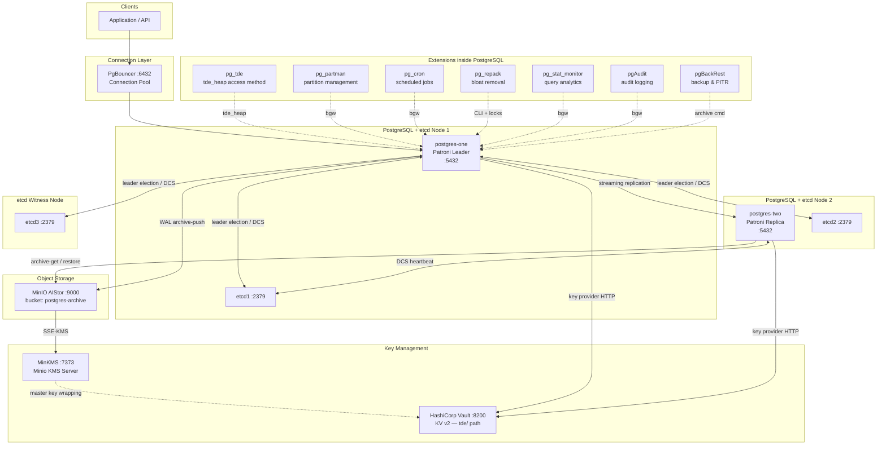

# PostgreSQL Infrastructure Research Documentation

## Overview

This documentation covers a production-grade PostgreSQL 18 high-availability (HA) stack built for R&D purposes on aarch64 / RHEL 9 (containerised via Docker). The architecture combines Patroni-managed leader election over a TLS-secured etcd cluster, Percona's transparent data encryption (pg_tde), MinIO AIStor object storage backed by MinKMS, and HashiCorp Vault for secrets management — resulting in a fully encrypted, auditable, and highly available database platform. Non-technical readers can find a plain-language executive summary at the top of each component file; engineers will find precise configuration listings, known issues, and operational runbooks throughout.

## Stack Architecture

## Component Index

| # | Component              | File                                               | Purpose                                    | Version / Source              |
|---|------------------------|----------------------------------------------------|--------------------------------------------|-------------------------------|
| 1 | PostgreSQL 18          | [01-postgresql.md](components/01-postgresql.md)   | Core database engine                        | 18.1 — Percona Distribution   |
| 2 | pg_tde                 | [02-pg_tde.md](components/02-pg_tde.md)           | Transparent Data Encryption                | Percona pg_tde                |
| 3 | PgBouncer              | [03-pgbouncer.md](components/03-pgbouncer.md)     | Connection pooling                          | percona-pgbouncer             |
| 4 | pg_partman             | [04-pg_partman.md](components/04-pg_partman.md)   | Partition management                        | pg_partman_18 (PGDG)          |
| 5 | pg_cron                | [05-pg_cron.md](components/05-pg_cron.md)         | Job scheduling inside PostgreSQL            | pg_cron_18 (PGDG)             |
| 6 | pg_repack              | [06-pg_repack.md](components/06-pg_repack.md)     | Online table/index bloat removal            | percona-pg_repack18           |
| 7 | Patroni                | [07-patroni.md](components/07-patroni.md)         | HA cluster management & leader election     | pip patroni[etcd3]            |
| 8 | etcd                   | [08-etcd.md](components/08-etcd.md)               | Distributed configuration store (DCS)       | quay.io/coreos/etcd:v3.5.16   |
| 9 | MinIO / AIStor / MinKMS| [09-minio-aistor-minkms.md](components/09-minio-aistor-minkms.md) | Object storage & KMS       | quay.io/minio/aistor images   |
|10 | HashiCorp Vault        | [10-vault.md](components/10-vault.md)             | Secrets management (pg_tde keys, tokens)    | hashicorp/vault:1.21          |
|11 | pgBench                | [11-pgbench.md](components/11-pgbench.md)         | Performance benchmarking                    | Built-in PostgreSQL tool      |
|12 | pgBackRest             | [12-pgbackrest.md](components/12-pgbackrest.md)   | Backup & Point-In-Time Recovery             | percona-pgbackrest            |
|13 | pg_stat_monitor        | [13-pg_stat_monitor.md](components/13-pg_stat_monitor.md) | Query performance analytics         | PGDG — pg_stat_monitor_18     |
|14 | pgAudit                | [14-pgaudit.md](components/14-pgaudit.md)         | Audit logging                               | postgresql-18-audit (PGDG)    |

## How to Read This Documentation

Each component file in `docs/components/` is structured with two layers:

1. **Executive Summary & Why This Matters** — at the top of every file. Written in plain language for non-technical stakeholders; explains what the component does and why the organisation needs it, with a reference to relevant compliance frameworks where applicable.
2. **Technical Detail sections** — follow the executive summary. These include actual configuration snippets lifted directly from the project files, key parameter explanations, integration points with other components, known issues discovered during R&D, and operational notes (health checks, diagnostic queries).

Runbooks for high-impact operational procedures (failover, backup/restore, key rotation) are in `docs/operations/`. Performance benchmark reference data is in `docs/benchmarks/`.

## Environment Summary

| Property              | Value                                                            |
|-----------------------|------------------------------------------------------------------|
| OS / Architecture     | RHEL 9 / aarch64 (arm64); x86_64 Dockerfile also provided       |
| Deployment model      | Docker Compose (multi-container, external `pg_network`)          |
| PostgreSQL version    | 18.1 (Percona Distribution)                                     |
| HA topology           | 1 leader (`postgres-one` + etcd1) + 1 replica (`postgres-two` + etcd2) |
| DCS                   | etcd v3.5.16 — 3-node cluster (co-located etcd1/2, separate etcd3)  |
| Encryption            | pg_tde with `tde_heap` access method; `default_table_access_method = tde_heap` |
| Key provider          | HashiCorp Vault (KV v2 at path `tde/`)                          |
| Connection pooler     | PgBouncer in `transaction` mode on port 6432                    |
| Backup repository     | MinIO AIStor (S3-compatible), bucket `postgres-archive`         |
| WAL archiving         | Enabled; `archive_command` uses pgBackRest                      |
| Stanza name           | `postgres-patroni-tde`                                           |
| Timezone              | Asia/Jakarta                                                     |
| TLS                   | mTLS everywhere — etcd client/peer, Patroni↔etcd, pgBackRest↔MinIO |

## References & Further Reading

- [Percona Distribution for PostgreSQL](https://www.percona.com/software/postgresql-database)
- [Patroni Documentation](https://patroni.readthedocs.io/)
- [etcd Documentation](https://etcd.io/docs/)
- [pgBackRest User Guide](https://pgbackrest.org/user-guide.html)
- [HashiCorp Vault Docs](https://developer.hashicorp.com/vault/docs)
- [MinIO AIStor](https://min.io/product/aistor)
- [pg_tde — Percona](https://docs.percona.com/pg-tde/)
