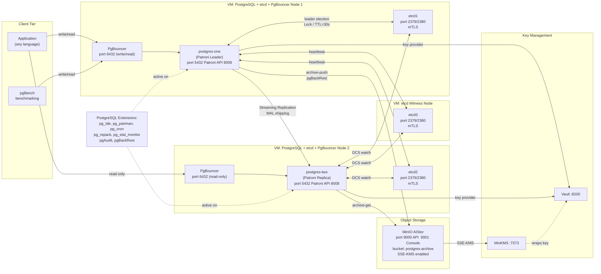
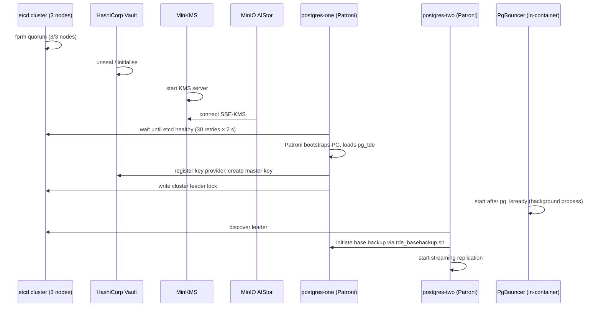
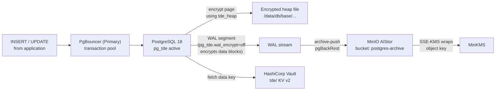

# Architecture Overview

## Executive Summary

This document provides a high-level view of how the fourteen components in this R&D stack interconnect. It is intended as a companion map to the detailed component files and operational runbooks.

## Why This Matters (Business / Compliance Context)

A multi-component architecture diagram makes it straightforward to communicate risk scope to security auditors (ISO 27001 Annex A.14, SOC 2 CC6) and helps engineers trace failure blast radius during incident response. At a glance, a reader can see that encrypted data never leaves the database without passing through a Vault-managed key, and that WAL segments are backed up encrypted to MinIO.

## Full Stack Architecture Diagram

## Component Dependency & Startup Order

The startup sequence matters because certain components depend on others being healthy:

## Network & Port Reference

| Service        | Host/Container   | Port(s)    | Protocol | Notes                              |
|----------------|------------------|------------|----------|------------------------------------|
| PostgreSQL     | postgres-one/two | 5432       | TCP      | pg_hba: md5 all 0.0.0.0/0          |
| PgBouncer      | postgres-one/two | 6432       | TCP      | transaction mode, md5 auth         |
| Patroni REST   | postgres-one/two | 8008       | HTTP     | cluster status, switchover API     |
| etcd client    | postgres-one/two, etcd3 | 2379       | HTTPS    | mTLS client + CA auth              |
| etcd peer      | postgres-one/two, etcd3 | 2380       | HTTPS    | mTLS peer auth                     |
| Vault          | vault            | 8200       | HTTP     | TLS disabled in dev/R&D mode       |
| MinKMS         | minkms           | 7373       | HTTPS    | mTLS using custom CA               |
| MinIO API      | minio            | 9000       | HTTPS    | S3-compatible                      |
| MinIO Console  | minio            | 9001       | HTTPS    | Web UI                             |

## Data Flow: Write Path (Encrypted)

## Security Boundary Summary

| Boundary                         | Protection Mechanism                                       |
|----------------------------------|------------------------------------------------------------|
| Data at rest (heap files)        | pg_tde `tde_heap` — AES encryption, key in Vault          |
| Data in transit (replication)    | PostgreSQL SSL / mTLS etcd (WAL bytes unencrypted in stream) |
| Backup objects in MinIO          | SSE-KMS via MinKMS; TLS in transit                        |
| etcd cluster communication       | mTLS mutual auth with custom Root CA                       |
| Vault token exposure             | AppRole tokens stored in `/etc/postgresql/secrets/` (mode 600) |
| PgBouncer auth                   | md5 `userlist.txt`                                         |

## References & Further Reading

- [Patroni Architecture](https://patroni.readthedocs.io/en/latest/patroni_configuration.html)
- [etcd Security Model](https://etcd.io/docs/v3.5/op-guide/security/)
- [pg_tde Architecture — Percona](https://docs.percona.com/pg-tde/architecture.html)
- [pgBackRest Architecture](https://pgbackrest.org/user-guide.html#concept)
- [MinIO KMS Guide](https://min.io/docs/minio/linux/operations/server-side-encryption.html)
