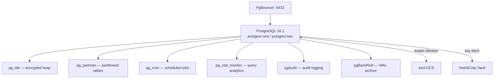

# PostgreSQL 18 — Percona Distribution

## Executive Summary

PostgreSQL is the core relational database engine at the heart of this infrastructure. This project uses **PostgreSQL 18.1** packaged by Percona, which includes enterprise-grade extensions and tooling on top of the standard open-source release. Every piece of data the organisation stores — customer records, transaction logs, audit trails — ultimately lives inside PostgreSQL's data files.

Percona's distribution was chosen because it delivers tested packaging of pg_tde (Transparent Data Encryption), pg_repack, and pgBackRest for aarch64 (ARM 64-bit) targets, which is the primary lab architecture. An Ubuntu-based Dockerfile for arm64 is also maintained in the repository to support CI pipelines running on standard Linux distributions.

## Why This Matters (Business / Compliance Context)

PostgreSQL 18's strong ACID guarantees and mature replication mechanisms directly underpin the organisation's data integrity and availability commitments. Deploying on a well-supported Percona distribution reduces the risk of undocumented behaviour from community-built packages. For compliance purposes (ISO 27001 A.12.1, SOC 2 Availability), having a documented, reproducible database build is essential for auditor evidence packages.

## Component Role in This Stack



## Version & Distribution

| Property        | Value                                                        |
|-----------------|--------------------------------------------------------------|
| Version         | 18.1                                                         |
| Source          | Percona Distribution for PostgreSQL (`percona/percona-distribution-postgresql:18.1`) |
| Install method  | Docker image (RPM-based base, PGDG repo added for extension gaps) |
| Architecture    | aarch64 (primary); x86_64 / arm64 Ubuntu Dockerfile also available |
| Data directory  | `/data/db`                                                   |
| Binary path     | `/usr/pgsql-18/bin`                                          |

## Configuration

### Dockerfile — aarch64 (Percona base)

```dockerfile
FROM percona/percona-distribution-postgresql:18.1

USER root
# Add PGDG repo for extension packages not yet in Percona repo
RUN dnf install -y https://download.postgresql.org/pub/repos/yum/reporpms/EL-9-aarch64/pgdg-redhat-repo-latest.noarch.rpm \
  && dnf -qy module disable postgresql \
  && dnf install -y \
     python3-pip        \
     percona-pgbouncer  \
     percona-pgbackrest \
     pg_partman_18      \  # partition management
     percona-pg_repack18\  # online bloat removal
     pg_cron_18         \  # in-database scheduler
     lz4 zstd net-tools

USER postgres
RUN pip3 install patroni[etcd3]       # Patroni HA manager

# Directories for Patroni, data, TDE key cache, PgBouncer
RUN mkdir -p /etc/patroni /data/db /data/pg_tde_keys \
  && mkdir -p /etc/postgresql/secrets \
  && touch /etc/postgresql/secrets/vault_token.txt \
  && mkdir -p /etc/pgbouncer \
  && chown -R postgres:postgres /etc/patroni /data /etc/postgresql /etc/pgbouncer \
  && chmod 700 /data/db /data/pg_tde_keys \
  && chmod 600 /etc/postgresql/secrets/vault_token.txt

EXPOSE 5432 6432 8008
ENTRYPOINT ["/entrypoint.sh"]
CMD ["patroni", "/etc/patroni/patroni.yml"]
```

### Patroni-managed PostgreSQL parameters (from `patroni-one.yml`)

```yaml
bootstrap:
  dcs:
    postgresql:
      use_pg_rewind: true     # allows replica to rejoin after diverged timeline
      use_slots: true         # physical replication slots prevent WAL eviction
      parameters:
        # Memory
        max_connections: 100
        shared_buffers: 256MB
        effective_cache_size: 1GB
        maintenance_work_mem: 64MB
        work_mem: 2621kB

        # WAL / Checkpoints
        checkpoint_completion_target: 0.9
        wal_buffers: 16MB
        min_wal_size: 1GB
        max_wal_size: 4GB
        wal_log_hints: "on"     # required for pg_rewind

        # Replication
        wal_level: replica
        hot_standby: "on"
        max_wal_senders: 10
        max_replication_slots: 10
        wal_keep_size: 1GB

        # Logging
        logging_collector: "on"
        log_directory: "log"
        log_filename: "postgresql-%Y-%m-%d_%H%M%S.log"
        log_rotation_age: 1d
        log_rotation_size: 100MB
        log_line_prefix: "%m [%p] %u@%d "
        log_timezone: "Asia/Jakarta"

        # Extensions loaded at startup
        shared_preload_libraries: "pg_tde, pg_partman_bgw, pg_stat_monitor, pg_cron, pgaudit"

        # TDE defaults
        pg_tde.wal_encrypt: "off"
        default_table_access_method: "tde_heap"   # all new tables encrypted by default

        # pgBackRest WAL archiving
        archive_mode: "on"
        archive_command: "pgbackrest --stanza=postgres-patroni-tde archive-push %p"
```

### Cluster initialisation

```yaml
  initdb:
    - encoding: UTF8
    - data-checksums       # required for pg_rewind integrity checks
    - locale: en_US.UTF-8

  pg_hba:
    - host replication replicator 0.0.0.0/0 md5
    - host all all 0.0.0.0/0 md5
    - host all all ::0/0 md5
```

### Key Parameters Explained

| Parameter                       | Value Found             | Effect                                                                 | Recommendation                                     |
|---------------------------------|-------------------------|------------------------------------------------------------------------|----------------------------------------------------|
| `shared_buffers`                | 256MB                   | Shared memory for page cache                                           | Increase to 25% of RAM in production              |
| `effective_cache_size`          | 1GB                     | Planner hint for OS + PG cache available                               | Set to total RAM minus `shared_buffers`            |
| `wal_level`                     | replica                 | Enables streaming replication                                          | Keep; `logical` if CDC needed                     |
| `max_wal_senders`               | 10                      | Max concurrent replication connections                                 | Adequate for 1 replica + pgBackRest               |
| `data-checksums`                | enabled via initdb      | Detects data corruption; required for pg_rewind                        | Always enable in production                        |
| `default_table_access_method`   | tde_heap                | All new tables use encrypted access method by default                  | Confirm all legacy tables are migrated             |
| `pg_tde.wal_encrypt`            | off                     | WAL segments are not encrypted; data blocks inside heap files are      | Enable with care: significant performance impact   |
| `archive_mode`                  | on                      | WAL archiving active; needed for PITR                                  | Confirm pgBackRest stanza is created first         |
| `log_line_prefix`               | `%m [%p] %u@%d `        | Includes timestamp, PID, user, and database name in every log line     | Add `%r` for client IP in production              |

## Integration Points

| Component     | Integration                                                                                     |
|---------------|-------------------------------------------------------------------------------------------------|
| Patroni       | Manages PostgreSQL lifecycle, DCS registration, failover, and pg_hba reloading                  |
| pg_tde        | Loaded via `shared_preload_libraries`; provides `tde_heap` access method                        |
| pg_partman    | Background worker (`pg_partman_bgw`) loaded at startup for automated partition maintenance       |
| pg_cron       | Loaded via `shared_preload_libraries`; uses `cron.database_name` [TO BE CONFIRMED: not found in config files] |
| pgAudit       | Loaded via `shared_preload_libraries`; hooks into executor to emit audit records                |
| pg_stat_monitor | Loaded via `shared_preload_libraries`; replaces `pg_stat_statements`                         |
| pgBackRest    | Called by `archive_command` for WAL; `restore_command` used during replica recovery             |
| PgBouncer     | Forwards client connections to port 5432; started inside same container via entrypoint script   |
| HashiCorp Vault | Accessed by pg_tde extension to fetch/store encryption keys; token in `/etc/postgresql/secrets/vault_token.txt` |

## Known Issues & Research Findings

### `heap` vs `tde_heap` on Partition Children

When `pg_partman` creates child partitions dynamically, earlier versions of pg_partman did not inherit the `default_table_access_method = tde_heap` set at the cluster level. Research task RC3-03 was opened to address this. The workaround is to use a partman **template table** with `USING tde_heap` specified, or to set `default_table_access_method` at the session level with `SET default_table_access_method = 'tde_heap';` before calling `create_parent()`.

or make it tde_heap as default table access method from startup.

Confirmed working approach (from `pg_repack_partman_tde_rnd.sample.sql`):
```sql
SET default_table_access_method = 'tde_heap'; -- session level
CREATE TABLE bloat_test_part_tde (...) PARTITION BY RANGE (created_at);
```

### `pg_tde.wal_encrypt = off`

WAL segments are not encrypted at the WAL layer. This is intentional — pg_tde.wal_encrypt is disabled because pgBackRest does not support WAL-level encryption from pg_tde. Instead, WAL is protected through two complementary controls: encryption at rest via pgBackRest's built-in encryption for backup and WAL archive storage, and TLS for encryption in transit during WAL streaming and archive transfer. Data pages inside the heap remain encrypted via the tde_heap access method. If WAL encryption is later enabled, performance must be re-benchmarked.

### Ubuntu arm64 Build Limitations

The `Dockerfile.arm64.postgres` targets Ubuntu 24.04 with PGDG apt packages. `percona-postgresql-18` is referenced but may not be available in the standard PGDG Ubuntu arm64 repo — this is marked [TO BE CONFIRMED: verify `apt-cache show percona-postgresql-18` on the build host].

## Operational Notes

### Health Check

```bash
# From host — check Patroni leader
curl -s http://localhost:8008/leader | jq .

# From inside container
patronictl -c /etc/patroni/patroni.yml list

# PostgreSQL readiness
pg_isready -h 127.0.0.1 -p 5432
```

### Extension Installation (after cluster bootstrap)

```bash
# Run the setup script
./scripts/postgres_setup.docker.sh
# This creates: pg_tde, pg_partman, pg_repack, pgstattuple, pg_stat_monitor, pg_cron
```

### Log Access

```bash
docker exec postgres-one ls /data/db/log/
docker exec postgres-one tail -f /data/db/log/postgresql-$(date +%Y-%m-%d)_*.log
```

## Performance Considerations

- `shared_buffers = 256MB` is conservative for production; tune upward with RAM.
- `default_table_access_method = tde_heap` adds an encryption/decryption pass on every page I/O. See `docs/benchmarks/pgbench-results.md` for measured overhead.
- `pg_partman_bgw` runs in the background; ensure `maintenance_work_mem` is set appropriately for partition creation workloads.

## References & Further Reading

- [Percona Distribution for PostgreSQL 18](https://www.percona.com/software/postgresql-database)
- [PostgreSQL 18 Release Notes](https://www.postgresql.org/docs/18/release-18.html)
- [Patroni Configuration Reference](https://patroni.readthedocs.io/en/latest/patroni_configuration.html)
- [pg_rewind Documentation](https://www.postgresql.org/docs/current/app-pgrewind.html)
- [PostgreSQL Data Checksums](https://www.postgresql.org/docs/current/checksums.html)
