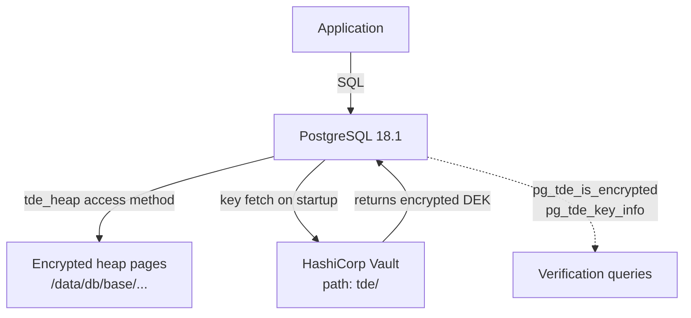

# pg_tde — Transparent Data Encryption

## Executive Summary

`pg_tde` is a PostgreSQL extension developed by Percona that encrypts data **at rest** inside the database's heap files — the physical files that store your tables and indexes on disk. When enabled, every page of data written to disk is automatically encrypted before it leaves PostgreSQL's memory, and decrypted when it is read back in. This happens transparently: your applications and SQL queries do not need to change at all.

In this infrastructure, **all new tables are encrypted by default** because PostgreSQL has been configured to use `tde_heap` as the default access method. The encryption keys are stored securely in HashiCorp Vault, which means that even if an attacker gains physical access to the server's disk, they cannot read the data without also having access to the Vault token.

## Why This Matters (Business / Compliance Context)

Data-at-rest encryption is a baseline requirement for virtually every major compliance framework. Without it, a stolen drive or cloud snapshot exposes raw database pages.

| Framework              | Relevant Control                        |
|------------------------|-----------------------------------------|
| ISO 27001              | Annex A.10.1 — Cryptography policy      |
| GDPR                   | Article 32 — Encryption of personal data|
| PCI-DSS                | Requirement 3.5 — Protect stored data   |
| SOC 2                  | CC6.1 — Logical access / encryption     |

The combination of pg_tde with Vault means the key management lifecycle (rotation, revocation, audit) is handled by a dedicated secrets management system rather than flat files.

## Component Role in This Stack



## Version & Distribution

| Property        | Value                                                        |
|-----------------|--------------------------------------------------------------|
| Version         | Bundled with Percona Distribution for PostgreSQL 18.1        |
| Source          | Percona (`percona/percona-distribution-postgresql:18.1` base image) |
| Install method  | Docker — included in base image                              |
| Architecture    | aarch64 / x86_64                                            |

## Configuration

### PostgreSQL parameters (from `patroni-one.yml`)

```yaml
parameters:
  shared_preload_libraries: "pg_tde, pg_partman_bgw, pg_stat_monitor, pg_cron, pgaudit"
  pg_tde.wal_encrypt: "off"                          # heap encrypted; WAL blocks not
  default_table_access_method: "tde_heap"            # all new tables use encrypted heap
```

### Key Provider Registration (from `postgres_setup.docker.sh`)

```bash
# pg_tde extension must be created first
run_sql "CREATE EXTENSION IF NOT EXISTS pg_tde;"

# Register the Vault KV v2 provider
run_sql "SELECT pg_tde_add_global_key_provider_vault_v2(
  'vault-provider',        -- name used in pg_tde
  'http://vault:8200',     -- Vault address
  'pg_tde',                -- KV mount path in Vault
  '/etc/postgresql/secrets/vault_token.txt',  -- token file (chmod 600)
  ''                       -- TLS CA (empty = system default)
);"

# Create a master key in Vault
run_sql "SELECT pg_tde_create_key_using_global_key_provider(
  'global-master-key',
  'vault-provider'
);"

# Set it as the default for all databases
run_sql "SELECT pg_tde_set_default_key_using_global_key_provider(
  'global-master-key',
  'vault-provider'
);"
```

### Vault setup (`vault-init.sh`)

```bash
# Enable KV v2 at the 'tde' path
vault secrets enable -path=tde -version=2 kv

# Policy: pg_tde needs read/write to tde/data/* and read on tde/metadata/*
vault policy write pg_tde-policy - <<EOF
path "pg_tde/data/*" {
  capabilities = ["read", "create", "update", "list"]
}
path "pg_tde/metadata/*" {
  capabilities = ["read", "list"]
}
path "sys/mounts/*" {
  capabilities = ["read"]
}
EOF

# AppRole auth for service accounts
vault auth enable approle
vault write auth/approle/role/tde-role policies="tde-policy"

# Generate token for PostgreSQL service
vault token create -policy="tde-policy" -ttl=8760h -field=token
```

### Using `tde_heap` in SQL

```sql
-- Explicit: create a table with tde_heap
CREATE TABLE secure_data (
  id         INTEGER GENERATED ALWAYS AS IDENTITY PRIMARY KEY,
  name       TEXT,
  amount     NUMERIC(10,2),
  created_at DATE
) USING tde_heap;

-- Implicit (default_table_access_method = tde_heap):
CREATE TABLE plain_looking_but_encrypted (
  id   SERIAL PRIMARY KEY,
  data TEXT
);

-- Verify encryption
SELECT pg_tde_is_encrypted('secure_data');   -- returns true
SELECT pg_tde_key_info();                    -- shows active key name + provider
```

### Key Parameters Explained

| Parameter                        | Value Found          | Effect                                                                          | Recommendation                                   |
|----------------------------------|----------------------|---------------------------------------------------------------------------------|--------------------------------------------------|
| `shared_preload_libraries`       | includes `pg_tde`    | Loads pg_tde at server startup so `tde_heap` AM is available                   | Must be first or near-first in list              |
| `pg_tde.wal_encrypt`             | `off`                | WAL segments written in plain; data blocks in heap are still encrypted          | Enable only after performance testing            |
| `default_table_access_method`    | `tde_heap`           | Every `CREATE TABLE` without `USING` clause uses encrypted heap                 | Verify child partitions inherit correctly        |
| Key provider name                | `vault-provider`     | Logical name registered in pg_tde; referenced by key creation calls             | Use a consistent namespace convention             |
| Master key name                  | `global-master-key`  | Name stored in Vault KV; timestamp-suffixed on rotation                         | Document rotation history for compliance         |
| Token file                       | `/etc/postgresql/secrets/vault_token.txt` (mode 600) | Vault token read by pg_tde to authenticate | Rotate token before TTL expiry (8760h = 1yr) |

## Integration Points

| Component       | Integration                                                                                    |
|-----------------|-----------------------------------------------------------------------------------------------|
| HashiCorp Vault | pg_tde calls Vault KV v2 API to fetch and store the master key; token is file-based           |
| PostgreSQL      | `tde_heap` is registered as an access method inside PostgreSQL's AM catalogue                 |
| pg_partman      | Child partitions must explicitly use `tde_heap`; session-level `SET` is the current workaround |
| pgBackRest      | Backups contain encrypted heap files; page-level encryption is preserved in backup files      |
| pg_repack       | Repacks TDE tables by creating temporary tables with the same `tde_heap` AM                   |

## Known Issues & Research Findings

### Partition Children Default AM

When `create_parent()` dynamically generates child partitions, they may default to `heap` rather than `tde_heap` even with `default_table_access_method = tde_heap` set globally. The R&D workaround confirmed to work is:

```sql
SET default_table_access_method = 'tde_heap';  -- session level before create_parent()
```

And verified with:

```sql
SELECT relname, amname
FROM pg_class c
JOIN pg_am am ON c.relam = am.oid
WHERE relname LIKE 'events%'
ORDER BY relname;
-- All partitions should show amname = 'tde_heap'
```

### WAL Encryption Disabled

`pg_tde.wal_encrypt = off` means WAL segments contain the changes to encrypted pages but in a form that reveals the *structure* of writes. For strict compliance scenarios that require WAL encryption, this must be enabled and performance re-evaluated.

### Encryption Verification (OS-level)

To confirm a file is encrypted from the OS, the following command was tested during R&D:

```bash
# Example path from SQL: SELECT pg_relation_filepath('table_name');
strings /data/db/base/5/16652
# Expected: scrambled output for tde_heap tables; readable strings for plain tables
```

### Vault Dev Mode

In the current R&D setup, Vault runs without TLS (`tls_disable: true`) and uses file storage. For production, Vault must be configured with TLS, a HA backend (Raft or Consul), and auto-unseal.

## Operational Notes

```bash
# Check registered key providers
docker exec postgres-one psql -U postgres -c "SELECT * FROM pg_tde_list_all_global_key_providers();"

# Check current server-level principal key
docker exec postgres-one psql -U postgres -c "SELECT * FROM pg_tde_server_key_info();"

# Check if a specific table is encrypted
docker exec postgres-one psql -U postgres -c "SELECT pg_tde_is_encrypted('secure_data');"

# View active key info
docker exec postgres-one psql -U postgres -c "SELECT pg_tde_key_info();"
```

## Performance Considerations

- **Heap I/O overhead**: Every page read and write involves an AES cipher operation. R&D pgBench results show approximately [TO BE CONFIRMED: run pgBench with and without tde_heap and record TPS delta] overhead on write-heavy workloads.
- **WAL overhead**: Currently zero because `pg_tde.wal_encrypt = off`.
- **Key fetch frequency**: The master key is fetched from Vault at startup and cached in shared memory; it is **not** fetched on every query. Key rotation requires a new key to be set and prompts a re-wrap of the Data Encryption Key (DEK).

## References & Further Reading

- [pg_tde Documentation — Percona](https://docs.percona.com/pg-tde/)
- [pg_tde Functions Reference](https://docs.percona.com/pg-tde/functions.html)
- [HashiCorp Vault KV v2](https://developer.hashicorp.com/vault/docs/secrets/kv/kv-v2)
- [PostgreSQL Table Access Methods](https://www.postgresql.org/docs/current/tableam.html)
