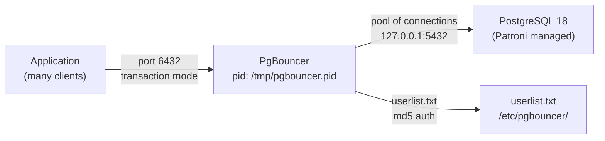

# PgBouncer — Connection Pooling

## Executive Summary

PgBouncer is a lightweight connection pooler that sits in front of PostgreSQL. Instead of each application client maintaining a permanent, resource-heavy connection directly to PostgreSQL, all clients connect to PgBouncer (port 6432), and PgBouncer maintains a much smaller pool of real connections to PostgreSQL (port 5432). This allows the system to handle hundreds of concurrent application clients without exhausting PostgreSQL's `max_connections` limit.

In this stack, PgBouncer runs **inside the same container** as the PostgreSQL/Patroni process. It is started automatically by the container's entrypoint script once PostgreSQL is ready, and listens on port 6432 for all incoming application traffic.

## Why This Matters (Business / Compliance Context)

Without connection pooling, PostgreSQL's `max_connections = 100` hard limit would cap concurrent users at 100. Modern applications and microservices routinely open many more connections than that, leading to "sorry, too many clients" errors and application downtime. PgBouncer makes the database scalable to hundreds of simultaneous clients at negligible infrastructure cost. It also provides a consistent connection endpoint that doesn't change during Patroni failovers (because it always points to `127.0.0.1:5432` which Patroni controls). This directly supports the organisation's availability SLA.

## Component Role in This Stack



## Version & Distribution

| Property        | Value                                                           |
|-----------------|-----------------------------------------------------------------|
| Version         | percona-pgbouncer (version [TO BE CONFIRMED: run `pgbouncer --version` inside container]) |
| Source          | Percona DNF repository / ubuntu `pgbouncer` apt package        |
| Install method  | Docker — installed in Dockerfile alongside PostgreSQL           |
| Architecture    | aarch64 / x86_64                                               |
| Config file     | `/etc/pgbouncer/pgbouncer.ini`                                  |
| Auth file       | `/etc/pgbouncer/userlist.txt`                                   |

## Configuration

### `/etc/pgbouncer/pgbouncer.ini`

```ini
[databases]
; Wildcard: proxy all database names to local PostgreSQL
* = host=127.0.0.1 port=5432

[pgbouncer]
listen_addr         = 0.0.0.0
listen_port         = 6432

; Authentication — md5 passwords from userlist.txt
auth_type           = md5
auth_file           = /etc/pgbouncer/userlist.txt

; Admin / stats access
admin_users         = postgres
stats_users         = postgres

; Pool configuration
pool_mode           = transaction        ; transaction-level pooling (most efficient)
max_client_conn     = 500               ; total concurrent client connections allowed
default_pool_size   = 75               ; server connections held per database+user pair
min_pool_size       = 25               ; connections kept up when idle
reserve_pool_size   = 75               ; extra connections for bursting
reserve_pool_timeout = 3               ; seconds before reserve pool is used

; Connection limits
max_db_connections  = 500
max_user_connections = 500

; Timeouts (seconds; 0 = unlimited)
server_idle_timeout = 600              ; remove idle server connection after 10 min
server_lifetime     = 3600             ; recycle server connection after 1 hour
server_connect_timeout = 15
query_timeout       = 0                ; no per-query timeout
query_wait_timeout  = 120              ; client waits max 2 min for a server connection
client_idle_timeout = 0
idle_transaction_timeout = 0

; Logging
log_connections     = 1
log_disconnections  = 1
log_pooler_errors   = 1
verbose             = 0

; Reset query between transactions
server_reset_query  = DISCARD ALL

; Health check
server_check_query  = SELECT 1
server_check_delay  = 30

; PID and socket
pidfile             = /tmp/pgbouncer.pid
unix_socket_dir     = /tmp
```

### Startup (entrypoint-postgres.sh)

```bash
# PgBouncer is started in the background after PostgreSQL becomes ready
(
  for i in {1..30}; do
    if pg_isready -h 127.0.0.1 -p 5432 > /dev/null 2>&1; then
      pgbouncer -d /etc/pgbouncer/pgbouncer.ini   # -d = daemon mode
      break
    fi
    sleep 2
  done
) &

exec "$@"   # start Patroni in foreground
```

### Key Parameters Explained

| Parameter               | Value Found | Effect                                                                    | Recommendation                            |
|-------------------------|-------------|---------------------------------------------------------------------------|-------------------------------------------|
| `pool_mode`             | transaction | Server connection released after each transaction, not session-end        | Best for stateless apps; avoid if using `SET` session-level |
| `max_client_conn`       | 500         | Hard cap on simultaneous clients across all pools                         | Increase if application demands exceed 500 |
| `default_pool_size`     | 75          | Number of real PG connections per pool; must be ≤ `max_connections - 3`  | Keep below PostgreSQL `max_connections`   |
| `min_pool_size`         | 25          | Pre-warmed connections to reduce connection latency                       | Set to expected steady-state concurrency  |
| `reserve_pool_size`     | 75          | Extra pool for burst above `default_pool_size`                            | Monitor `cl_waiting`; increase if > 0    |
| `query_wait_timeout`    | 120         | Client returns error after 2 min waiting for a pool slot                  | Tune to application query time expectations |
| `server_reset_query`    | DISCARD ALL | Clears session state between transactions                                 | Required in transaction mode              |
| `auth_type`             | md5         | Password hashed with MD5; consider `scram-sha-256` for stronger auth     | Upgrade to SCRAM in production            |

## Integration Points

| Component     | Integration                                                                              |
|---------------|------------------------------------------------------------------------------------------|
| PostgreSQL    | PgBouncer connects to `127.0.0.1:5432`; shares the same container                       |
| Patroni       | Patroni controls port 5432 (promotes/demotes); PgBouncer automatically follows because it always points to localhost |
| pgBench       | pgBench tests run against both port 5432 (direct) and port 6432 (via PgBouncer) in `pgbench_test.docker.sh` |
| Application   | Port 6432 is the recommended connection endpoint for all application traffic             |

## Known Issues & Research Findings

### `DISCARD ALL` Incompatibility with Prepared Statements

`pool_mode = transaction` with `server_reset_query = DISCARD ALL` is incompatible with persistent prepared statements (protocol-level, not SQL-level). Applications using `PREPARE` / `EXECUTE` in the PostgreSQL extended query protocol must either:
- Use `pool_mode = session` (less efficient), or
- Use pgBouncer's `server_reset_query_always = 0` with `DEALLOCATE ALL` instead.

### PgBouncer Not HA-Aware

PgBouncer connects to `127.0.0.1:5432` which is always the local node. When Patroni promotes `postgres-two` to leader while `postgres-one` is down, writes that go through the old `postgres-one:6432` will fail. For true transparent HA, a DNS-based virtual IP or a load balancer in front of PgBouncer instances is required.

## Operational Notes

```bash
# Connect to PgBouncer admin console
psql -h 127.0.0.1 -p 6432 -U postgres pgbouncer

# Show pool status
SHOW POOLS;

# Show server connections
SHOW SERVERS;

# Show client connections
SHOW CLIENTS;

# Show statistics
SHOW STATS;

# Reload config without restart
RELOAD;

# Reload from OS
docker exec postgres-one pkill -HUP pgbouncer

# Ping test script
./scripts/pgbouncer_ping_test.docker.sh
```

## Performance Considerations

- In pgBench tests (see `docs/benchmarks/pgbench-results.md`), transaction-mode PgBouncer delivered very similar TPS to direct PostgreSQL connection while supporting far more clients than `max_connections = 100` allows.
- Pool exhaustion (`cl_waiting > 0`) is indicated in `SHOW POOLS` output. When this occurs, increase `default_pool_size` or reduce application connection churn.
- `DISCARD ALL` adds a small overhead per transaction; disable `server_reset_query` only if your application guarantees no cross-transaction session state.

## References & Further Reading

- [pgBouncer Documentation](https://www.pgbouncer.org/config.html)
- [Percona pgBouncer](https://www.percona.com/software/postgresql-database/pgbouncer)
- [pgBouncer Pool Modes](https://www.pgbouncer.org/features.html)
- [STRESS_TEST_GUIDE.md](../../STRESS_TEST_GUIDE.md) — PgBouncer tuning guidance based on pgBench results
