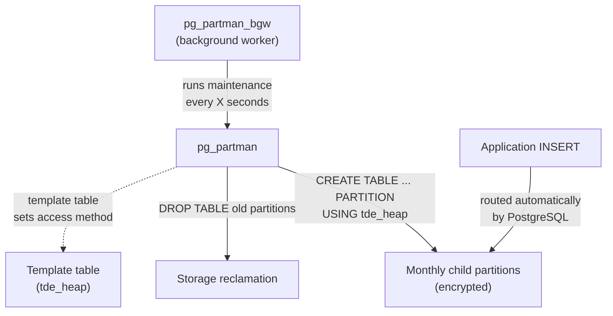

# pg_partman — Partition Management

## Executive Summary

`pg_partman` is a PostgreSQL extension that automates the creation and maintenance of table partitions. Without it, a database administrator would need to manually create a new monthly table partition every month, clean up old ones, and manage the routing logic — a tedious and error-prone process. With pg_partman, you simply tell it "partition this table by month, keep 6 months of pre-made future partitions, and retain 12 months of history," and it handles everything automatically in the background.

In this stack, pg_partman is used to manage time-series-style tables (event logs, bloat-test tables) and is specifically configured to work with `tde_heap` so that all partition children are encrypted by default.

## Why This Matters (Business / Compliance Context)

Large tables without partitioning become slow to query and difficult to archive. Partitioning allows the team to:
- **Prune old data** by dropping entire partition files (instant, no bloat) rather than row-by-row DELETE.
- **Speed up queries** through partition pruning (the database only scans relevant months).
- **Comply with retention policies** by automating the removal of data older than the mandated retention window (for GDPR compliance, for example).

This aligns with ISO 27001 A.8.3 (media handling / data disposal) and GDPR Article 5(e) (storage limitation).

## Component Role in This Stack



## Version & Distribution

| Property        | Value                                                                  |
|-----------------|------------------------------------------------------------------------|
| Version         | pg_partman_18 (from PGDG `pgdg-redhat-repo` / `postgresql-18-pg-partman`) |
| Source          | PGDG yum/apt repository                                                |
| Install method  | Docker — DNF/apt package; schema installed via `CREATE EXTENSION`      |
| Architecture    | aarch64 / x86_64                                                       |

## Configuration

### Shared preload (from `patroni-one.yml`)

```yaml
shared_preload_libraries: "pg_tde, pg_partman_bgw, pg_stat_monitor, pg_cron, pgaudit"
# pg_partman_bgw is the background worker that runs automatic maintenance
```

### Extension Installation

```sql
CREATE EXTENSION IF NOT EXISTS pg_partman;
```

### Encrypted Partitioned Table Setup (`pg_partman_setup_encrypt.sample.sql`)

```sql
-- 1. Create the parent partitioned table (no access method needed here)
CREATE TABLE events_encrypted (
    id          BIGSERIAL,
    created_at  TIMESTAMPTZ NOT NULL DEFAULT now(),
    payload     TEXT
) PARTITION BY RANGE (created_at);

-- 2. Register with pg_partman: 1-month intervals, 6 future partitions pre-created
SELECT public.create_parent(
    p_parent_table  => 'public.events_encrypted',
    p_control       => 'created_at',
    p_interval      => '1 month',
    p_premake       => 6           -- 6 months of future partitions created ahead
);

-- 3. Insert sample data; routes automatically to correct partition
INSERT INTO events_encrypted(created_at, payload) VALUES
    ('2025-11-15', 'november event'),
    ('2025-12-10', 'december event'),
    ('2026-01-20', 'january event'),
    ('2026-02-05', 'february event');
```

### Plain Table Partitioning (`pg_partman_setup_plain.sample.sql`)

```sql
CREATE TABLE events (
    id          BIGSERIAL,
    created_at  TIMESTAMPTZ NOT NULL DEFAULT now(),
    payload     TEXT
) PARTITION BY RANGE (created_at);

SELECT public.create_parent(
    p_parent_table  => 'public.events',
    p_control       => 'created_at',
    p_interval      => '1 month',
    p_premake       => 6
);
```

### Partitioned + TDE + pg_repack Pattern (`pg_repack_partman_tde_rnd.sample.sql`)

```sql
-- Set access method at session level before create_parent to ensure children inherit tde_heap
SET default_table_access_method = 'tde_heap';

CREATE TABLE bloat_test_part_tde (
    id          BIGSERIAL,
    payload     TEXT,
    created_at  TIMESTAMPTZ NOT NULL DEFAULT now(),
    PRIMARY KEY (id, created_at)   -- partition key must be in PK for pg_repack
) PARTITION BY RANGE (created_at);

-- Delete any stale config
DELETE FROM public.part_config WHERE parent_table = 'public.bloat_test_part_tde';

SELECT public.create_parent(
    p_parent_table  => 'public.bloat_test_part_tde',
    p_control       => 'created_at',
    p_interval      => '1 month',
    p_premake       => 6
);

-- Insert 500k rows spread across 5 future months
INSERT INTO bloat_test_part_tde (payload, created_at)
SELECT
    md5(random()::text) || repeat('x', 200),
    now() + (random() * 5 * interval '1 month')
FROM generate_series(1, 500000);
```

### Key Parameters Explained

| Parameter          | Value Found    | Effect                                                            | Recommendation                             |
|--------------------|----------------|-------------------------------------------------------------------|--------------------------------------------|
| `p_interval`       | `1 month`      | Each partition covers one calendar month                          | Use `1 week` for very high-volume tables   |
| `p_premake`        | 6              | 6 future partitions created in advance by the maintenance job     | Increase if bulk-loading mid-cycle         |
| `p_control`        | `created_at`   | Column used for range partitioning                                | Must be NOT NULL; use TIMESTAMPTZ          |
| `pg_partman_bgw`   | in shared_preload | Background worker runs `run_maintenance()` automatically       | Set `pg_partman_bgw.interval` [TO BE CONFIRMED: not found in config] |

## Integration Points

| Component     | Integration                                                                                  |
|---------------|----------------------------------------------------------------------------------------------|
| PostgreSQL    | pg_partman operates fully within PostgreSQL; uses `pg_inherits` and `part_config` tables     |
| pg_tde        | Session-level `SET default_table_access_method = 'tde_heap'` ensures children are encrypted |
| pg_repack     | Partitioned table children can be repacked individually (parent table cannot be repacked)    |
| pg_cron       | [TO BE CONFIRMED: check if `SELECT partman.run_maintenance()` is scheduled via pg_cron jobs] |

## Known Issues & Research Findings

### Child Partitions Not Inheriting `tde_heap` (RC3-03)

The most significant finding in R&D: child partitions created by `create_parent()` would default to `heap` rather than `tde_heap` when inheriting the parent's attributes, even when `default_table_access_method = tde_heap` was set globally.

**Root cause**: The `CREATE TABLE ... PARTITION OF` statement used internally by pg_partman did not always propagate the access method from the session-level default.

**Workaround applied**: Issue `SET default_table_access_method = 'tde_heap'` at the session level immediately before calling `create_parent()`. Confirmed working by checking `pg_class.relam` after partition creation:

```sql
SELECT relname, amname
FROM pg_class c
JOIN pg_am am ON c.relam = am.oid
WHERE relname LIKE 'events_encrypted%'
ORDER BY relname;
-- All rows should show amname = 'tde_heap'
```

### Primary Key Constraint for pg_repack Compatibility

`pg_repack` requires every table it processes to have a PRIMARY KEY. For partitioned tables, the partition control column (`created_at`) **must be included in the PRIMARY KEY** because PostgreSQL requires the partition key to be part of the PK for declarative partitioning. Example:

```sql
PRIMARY KEY (id, created_at)   -- id alone would fail for a range-partitioned table
```

### `pg_partman_bgw.interval` Not Set

[TO BE CONFIRMED: check if `pg_partman_bgw.interval` or `pg_partman_bgw.dbname` is set in `patroni-one.yml` or `postgresql.conf`. Without this, the background worker runs with default interval and may not know which database to maintain.]

## Operational Notes

```bash
# Manually run partition maintenance
docker exec postgres-one psql -U postgres -c "SELECT partman.run_maintenance(p_analyze := false);"

# Check registered partitioned tables
docker exec postgres-one psql -U postgres -c "SELECT * FROM partman.part_config;"

# Check generated partition names and access methods
docker exec postgres-one psql -U postgres -c "
SELECT c.relname, am.amname
FROM pg_class c
JOIN pg_am am ON c.relam = am.oid
WHERE c.relname LIKE 'events%'
ORDER BY c.relname;"

# Verify partition is getting data
docker exec postgres-one psql -U postgres -c "
SELECT tableoid::regclass AS partition, count(*)
FROM events_encrypted
GROUP BY 1 ORDER BY 1;"
```

## Performance Considerations

- Partition pruning dramatically reduces scan scope for range queries with `WHERE created_at >= ... AND created_at < ...`. Verify with `EXPLAIN (ANALYZE, BUFFERS)` to confirm only relevant partitions are accessed.
- `pg_partman_bgw` runs maintenance in the background; it should be given adequate `maintenance_work_mem`.
- Dropping old partitions (retention) is instantaneous (a single DDL operation) versus a row-by-row `DELETE` which would require a subsequent VACUUM to reclaim space.

## References & Further Reading

- [pg_partman GitHub](https://github.com/pgpartman/pg_partman)
- [pg_partman Documentation](https://github.com/pgpartman/pg_partman/blob/master/doc/pg_partman.md)
- [PostgreSQL Declarative Partitioning](https://www.postgresql.org/docs/current/ddl-partitioning.html)
- [pg_partman + pg_tde R&D: `pg_partman_setup_encrypt.sample.sql`](../../postgres/pg_partman_setup_encrypt.sample.sql)
