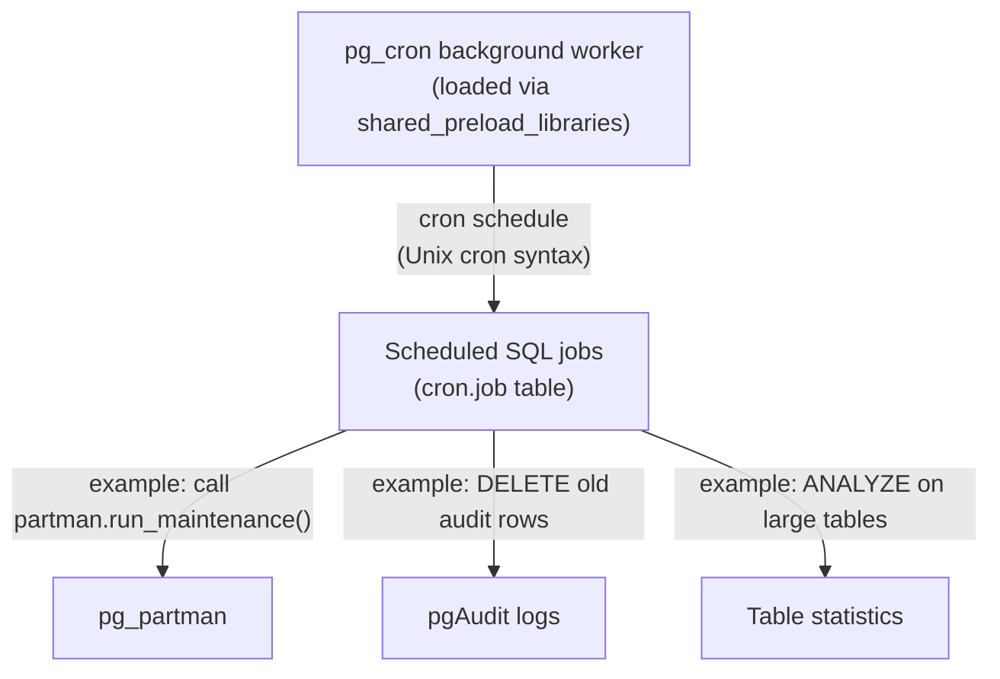

# pg_cron — Job Scheduling

## Executive Summary

`pg_cron` is a PostgreSQL extension that allows you to schedule recurring tasks — such as running a SQL query or calling a stored procedure — directly inside the database, using standard cron syntax. Think of it as a "cron tab" that lives inside PostgreSQL rather than on the operating system. This removes the need to manage external schedulers for database maintenance tasks.

In this stack, pg_cron is loaded at startup alongside the other extensions and can be used to schedule regular partition maintenance calls, statistics refreshes, or custom cleanup jobs without requiring external infrastructure.

## Why This Matters (Business / Compliance Context)

Automating routine database maintenance (like running `partman.run_maintenance()` or purging old audit logs) reduces operational risk caused by human error or forgotten manual steps. Having the scheduler live inside the database also gives a single pane of glass for database administrators without requiring OS-level cron access. This supports SOC 2 CC7 (change management) and improves operational reliability.

## Component Role in This Stack



## Version & Distribution

| Property        | Value                                                             |
|-----------------|-------------------------------------------------------------------|
| Version         | pg_cron_18 (from PGDG `pgdg-redhat-repo` / `postgresql-18-cron`) |
| Source          | PGDG yum/apt repository                                           |
| Install method  | Docker — DNF/apt package; activated via `CREATE EXTENSION`        |
| Architecture    | aarch64 / x86_64                                                  |

## Configuration

### Shared preload (from `patroni-one.yml`)

```yaml
shared_preload_libraries: "pg_tde, pg_partman_bgw, pg_stat_monitor, pg_cron, pgaudit"
# pg_cron must be in shared_preload_libraries to register its background worker at startup
```

### pg_cron Database Setting

```yaml
# TO BE CONFIRMED: cron.database_name is not explicitly set in patroni-one.yml or patroni-two.yml.
# The extension defaults to the database where 'CREATE EXTENSION pg_cron' is run.
# Expected value: 'postgres'
# To verify: SELECT current_setting('cron.database_name');
```

### Extension Installation

```sql
CREATE EXTENSION IF NOT EXISTS pg_cron;
```

### Scheduling Jobs

```sql
-- Example: run pg_partman maintenance every 30 minutes
SELECT cron.schedule(
    'partman-maintenance',             -- job name
    '*/30 * * * *',                    -- cron expression: every 30 minutes
    $$SELECT partman.run_maintenance(p_analyze := false)$$
);

-- Example: run ANALYZE on the encrypted events table nightly at 2 AM
SELECT cron.schedule(
    'nightly-analyze-events',
    '0 2 * * *',
    $$ANALYZE events_encrypted$$
);

-- List all scheduled jobs
SELECT * FROM cron.job;

-- View job execution history
SELECT * FROM cron.job_run_details ORDER BY start_time DESC LIMIT 20;

-- Remove a job
SELECT cron.unschedule('partman-maintenance');
```

### Key Parameters Explained

| Parameter               | Value Found                                | Effect                                                                | Recommendation                                            |
|-------------------------|--------------------------------------------|-----------------------------------------------------------------------|-----------------------------------------------------------|
| `cron.database_name`    | [TO BE CONFIRMED: default = 'postgres']    | The database where the pg_cron background worker connects to run jobs | Set explicitly in `postgresql.conf` or Patroni parameters |
| `shared_preload_libraries` | includes `pg_cron`                      | Enables the pg_cron background worker process at server startup       | Must be present before `CREATE EXTENSION` is called       |
| Job schedule            | Standard cron syntax                       | 5-field (min hour dom mon dow) or 6-field with seconds                | Use `cron.schedule_in_database()` for multi-DB setups     |

## Integration Points

| Component     | Integration                                                                                       |
|---------------|---------------------------------------------------------------------------------------------------|
| pg_partman    | pg_cron can schedule `partman.run_maintenance()` as a fallback or complement to `pg_partman_bgw`  |
| pgAudit       | pg_cron can schedule periodic archival or deletion of old audit log rows                          |
| PostgreSQL    | Jobs run inside the database engine; they have access to all tables and extensions                |

## Known Issues & Research Findings

### `cron.database_name` Not Explicitly Configured

The `cron.database_name` GUC is not set in `patroni-one.yml` or `patroni-two.yml`. pg_cron defaults to the database it was installed in. If you install pg_cron in `postgres` but want jobs to run against another database, you must use `cron.schedule_in_database()`.

[TO BE CONFIRMED: check the output of `SHOW cron.database_name;` inside the running container to confirm the default value.]

### No Scheduled Jobs Found in Repository

No `INSERT INTO cron.job` statements or `SELECT cron.schedule(...)` calls were found in the project SQL files. pg_cron is loaded and the extension is created, but no recurring jobs have been defined yet.

**Recommendation**: Schedule at minimum `partman.run_maintenance()` to complement the `pg_partman_bgw` background worker.

### Cron Jobs Do Not Survive `DROP EXTENSION`

If `DROP EXTENSION pg_cron CASCADE` is executed, all job definitions in `cron.job` are lost. Always script your job definitions so they can be re-applied after an extension reinstall.

## Operational Notes

```bash
# Connect to the pg_cron metadata database
docker exec postgres-one psql -U postgres -d postgres

# Inside psql:
-- View all jobs
SELECT jobid, schedule, command, nodename, nodeport, database, username, active
FROM cron.job;

-- View last 10 job runs
SELECT job_id, job_pid, database, command, status, return_message, start_time, end_time
FROM cron.job_run_details
ORDER BY start_time DESC
LIMIT 10;

-- Pause a job (set active = false)
UPDATE cron.job SET active = false WHERE jobname = 'partman-maintenance';

-- Resume a job
UPDATE cron.job SET active = true WHERE jobname = 'partman-maintenance';
```

## Performance Considerations

- pg_cron runs jobs sequentially within its scheduler process. For long-running tasks, use `pg_background` or schedule lightweight wrapper procedures that use `PERFORM pg_sleep(0)` to yield.
- Scheduling `ANALYZE` or `VACUUM ANALYZE` via pg_cron is valid for tables that autovacuum does not cover adequately (e.g., bulk-loaded partitions).
- `run_maintenance()` for pg_partman is typically fast (milliseconds) unless many partitions need to be created simultaneously.

## References & Further Reading

- [pg_cron GitHub](https://github.com/citusdata/pg_cron)
- [pg_cron — Citus Documentation](https://docs.citusdata.com/en/stable/reference/user_defined_functions.html)
- [Cron Expression Reference](https://crontab.guru/)
- [pg_partman maintenance scheduling](https://github.com/pgpartman/pg_partman/blob/master/doc/pg_partman.md#running-maintenance)
