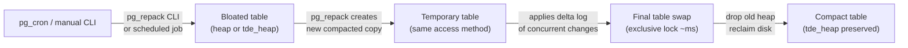

# pg_repack — Online Bloat Removal

## Executive Summary

Over time, PostgreSQL tables accumulate "bloat" — wasted empty space left behind by deleted and updated rows that standard VACUUM cannot reclaim without locking the table. `pg_repack` solves this problem by rebuilding tables and indexes online, without taking the table offline or blocking normal reads and writes. It effectively does what `VACUUM FULL` does (reclaims all wasted space) but without the exclusive lock that would make the table unavailable during the operation.

In this infrastructure, pg_repack has been tested against both plain and TDE-encrypted tables, and against partitioned tables managed by pg_partman. The R&D validates that pg_repack works correctly with the `tde_heap` access method.

## Why This Matters (Business / Compliance Context)

Table bloat causes two operational problems: (1) wasted disk space (storage cost) and (2) degraded query performance because the database scans more pages than necessary. Without online bloat removal, the only alternative is a maintenance window with `VACUUM FULL`, which is unacceptable for a continuous-availability system. pg_repack removes the need for planned downtime for storage reclamation, directly supporting the organisation's RTO/RPO SLA.

## Component Role in This Stack



## Version & Distribution

| Property        | Value                                                                    |
|-----------------|--------------------------------------------------------------------------|
| Version         | percona-pg_repack18 (aarch64) / postgresql-18-repack (Ubuntu arm64)     |
| Source          | Percona DNF repository / PGDG apt                                        |
| Install method  | Docker — DNF/apt package; activated via `CREATE EXTENSION`               |
| Architecture    | aarch64 / x86_64                                                         |

## Configuration

### Extension Installation

```sql
CREATE EXTENSION IF NOT EXISTS pg_repack;
CREATE EXTENSION IF NOT EXISTS pgstattuple;   -- used for accurate bloat measurement
```

### Plain Table Bloat Test (`pg_repack_setup.sample.sql`)

```sql
-- 1. Create test table (pg_repack REQUIRES a PRIMARY KEY)
CREATE TABLE bloat_test (
    id         SERIAL PRIMARY KEY,
    payload    TEXT,
    created_at TIMESTAMPTZ DEFAULT now()
);

-- 2. Insert 500k rows to build up data
INSERT INTO bloat_test (payload)
SELECT md5(random()::text) || repeat('x', 200)
FROM generate_series(1, 500000);

ANALYZE bloat_test;

-- 3. Create bloat: delete 80% of rows, update remaining rows
DELETE FROM bloat_test WHERE id % 5 != 0;
UPDATE bloat_test SET payload = md5(random()::text) WHERE id % 2 = 0;
UPDATE bloat_test SET payload = md5(random()::text) WHERE id % 3 = 0;

-- 4. Measure bloat BEFORE repack
SELECT
    table_len, tuple_count, tuple_len,
    dead_tuple_count, dead_tuple_len,
    round(dead_tuple_percent::numeric, 2) AS dead_pct,
    free_space,
    round(free_percent::numeric, 2) AS free_pct
FROM pgstattuple('bloat_test');
-- Note: free_percent may be ~88% even with dead_tuple_count = 0
-- (autovacuum reclaimed dead tuples but heap pages are still allocated)
```

### pg_repack CLI Command

```bash
pg_repack \
  --host=localhost \
  --port=5432 \
  --username=postgres \
  --dbname=postgres \
  --table=bloat_test \
  --no-order \             # VACUUM FULL semantics (no CLUSTER ordering)
  --wait-timeout=60 \      # seconds to wait for final exclusive lock
  --elevel=DEBUG
```

### TDE Table Bloat Test (`pg_repack_tde_setup.sample.sql`)

```sql
-- Identical flow but with tde_heap access method
CREATE TABLE bloat_test_tde (
    id         SERIAL PRIMARY KEY,
    payload    TEXT,
    created_at TIMESTAMPTZ DEFAULT now()
) USING tde_heap;

-- ... same insert / delete / update pattern ...

-- Capture before metrics
SELECT
    'bloat_test_tde'                                             AS table_name,
    pg_size_pretty(pg_relation_size('bloat_test_tde'))           AS heap_size,
    pg_size_pretty(pg_total_relation_size('bloat_test_tde'))     AS total_size_with_indexes,
    (SELECT dead_tuple_percent FROM pgstattuple('bloat_test_tde')) AS dead_pct;

-- Run pg_repack from CLI (same flags, --table=bloat_test_tde)
```

### Partitioned TDE Table Repack (`pg_repack_partman_tde_rnd.sample.sql`)

```sql
-- pg_repack cannot repack a partitioned table parent directly.
-- Run repack per-partition child:
pg_repack \
  --host=localhost \
  --port=5432 \
  --username=postgres \
  --dbname=postgres \
  --table=bloat_test_part_tde_20260401 \  -- specific child partition name
  --no-order \
  --wait-timeout=60 \
  --elevel=DEBUG

-- Capture AFTER metrics per partition
SELECT
    c.relname AS partition_name,
    pg_size_pretty(pg_relation_size(c.oid)) AS heap_size,
    pg_size_pretty(pg_total_relation_size(c.oid)) AS total_size,
    st.dead_tuple_count,
    round(st.dead_tuple_percent::numeric, 2) AS dead_pct,
    round(st.free_percent::numeric, 2) AS free_pct
FROM pg_class c
JOIN pg_inherits i ON c.oid = i.inhrelid
JOIN pg_class p ON i.inhparent = p.oid
CROSS JOIN LATERAL pgstattuple(c.oid::regclass) st
WHERE p.relname = 'bloat_test_part_tde'
ORDER BY c.relname;
```

### Key Parameters Explained

| Parameter           | Value Used      | Effect                                                                   | Recommendation                                 |
|---------------------|-----------------|--------------------------------------------------------------------------|------------------------------------------------|
| `--no-order`        | present         | VACUUM FULL semantics — no re-clustering by index                        | Use unless you have a defined CLUSTER index    |
| `--wait-timeout`    | 60 (seconds)    | Kills conflicting queries if they hold the lock past this timeout        | Increase for busy OLTP tables                  |
| `--elevel`          | DEBUG           | Verbose output for R&D analysis                                          | Use INFO in production                         |
| `--jobs`            | not set         | Parallelises index rebuilds (default: single-threaded)                   | Set to number of indexes for large tables      |
| `--dry-run`         | not used        | Preview what would be repacked without doing it                          | Always run `--dry-run` first in production     |

## Integration Points

| Component     | Integration                                                                                         |
|---------------|-----------------------------------------------------------------------------------------------------|
| pg_tde        | pg_repack creates the temporary table with the same access method (`tde_heap`); encryption is preserved |
| pg_partman    | pg_repack targets **specific child partitions**, not the parent table                               |
| pgstattuple   | Used for accurate bloat measurement before/after repack (more reliable than `pg_stat_user_tables`)  |
| pg_cron       | [TO BE CONFIRMED: Repack schedule not found in project files; could be added as a nightly pg_cron job] |

## Known Issues & Research Findings

### Autovacuum May Run Between INSERT and Measurement

A key R&D finding documented in the SQL files:

> `dead_tuple_count = 0` but `free_percent = 88.24%` — this is expected. Autovacuum ran between the DELETE and the pgstattuple call. It cleaned dead tuples but did not return space to the OS. The pages are still allocated, just marked free internally. **This is exactly the bloat pg_repack is designed to fix.**

After pg_repack: `dead_tuple_percent ≈ 0`, `table_len` significantly smaller, `free_percent` near 0.

### pg_repack Cannot Repack Partitioned Parent Tables

`pg_repack` will refuse with an error if given the name of a declarative partition parent. Each child partition must be repacked individually. For tables with many partitions, script a loop:

```bash
psql -U postgres -c "
SELECT inhrelid::regclass::text AS partition_name
FROM pg_inherits
WHERE inhparent = 'bloat_test_part_tde'::regclass;" \
-t | while read PART_NAME; do
  pg_repack --host=localhost --port=5432 --username=postgres \
    --dbname=postgres --table="$PART_NAME" --no-order --wait-timeout=60
done
```

### TDE Compatibility Confirmed

pg_repack was verified to work correctly with `tde_heap` tables. The temporary working table created by pg_repack inherits the same access method, so data remains encrypted throughout the process.

## Operational Notes

```bash
# Check extension version
SELECT extversion FROM pg_extension WHERE extname = 'pg_repack';

# Identify largest bloated tables (candidates for repack)
SELECT
    s.relname AS table_name,
    pg_size_pretty(pg_total_relation_size(c.oid)) AS total_size,
    round(100.0 * s.n_dead_tup / NULLIF(s.n_live_tup + s.n_dead_tup, 0), 2) AS dead_pct
FROM pg_stat_user_tables s
JOIN pg_class c ON c.relname = s.relname
WHERE round(100.0 * s.n_dead_tup / NULLIF(s.n_live_tup + s.n_dead_tup, 0), 2) > 10
ORDER BY pg_total_relation_size(c.oid) DESC;

# Run repack on a specific table (from inside or outside container)
docker exec postgres-one pg_repack \
  --host=localhost --port=5432 \
  --username=postgres --dbname=postgres \
  --table=bloat_test --no-order --wait-timeout=60
```

## Performance Considerations

- pg_repack holds only a brief exclusive lock at the final swap step (typically milliseconds). The rebuild itself runs concurrently.
- Running repack on large TDE tables with many indexes is CPU-intensive. Schedule during off-peak hours.
- Use `--jobs=N` (parallelise index rebuilds) for tables with many indexes to reduce total elapsed time.
- After repack, indexes are rebuilt, so access patterns to those indexes are reset. The planner may choose different plans until statistics catch up — run `ANALYZE` after repack.

## References & Further Reading

- [pg_repack GitHub](https://github.com/reorg/pg_repack)
- [pg_repack Documentation](https://reorg.github.io/pg_repack/)
- [pgstattuple](https://www.postgresql.org/docs/current/pgstattuple.html)
- [Project R&D files: pg_repack_setup.sample.sql](../../postgres/pg_repack_setup.sample.sql)
- [Project R&D files: pg_repack_tde_setup.sample.sql](../../postgres/pg_repack_tde_setup.sample.sql)
- [Project R&D files: pg_repack_partman_tde_rnd.sample.sql](../../postgres/pg_repack_partman_tde_rnd.sample.sql)
