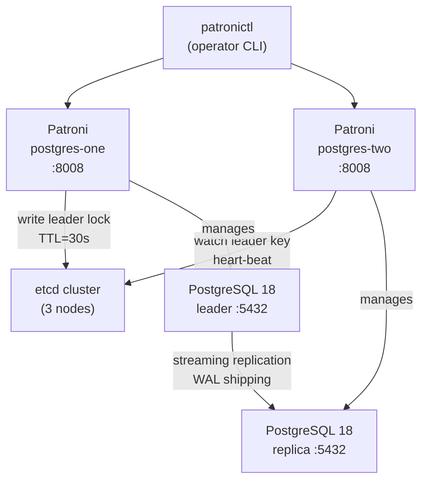

# Patroni — HA Cluster Management

## Executive Summary

Patroni is an open-source tool that turns a standard PostgreSQL installation into a highly available cluster. It automatically elects a leader ("primary") from a group of PostgreSQL instances, manages failover when the leader fails, and ensures that only one member writes data at any given time — a critical guarantee that prevents data corruption. Patroni uses etcd as its coordination backbone: all cluster state (who is the leader, what is the current timeline) is stored in etcd, and Patroni members continuously read and write to it.

In this stack, Patroni manages two PostgreSQL nodes (`postgres-one` and `postgres-two`) and uses a custom `tde_basebackup` method to ensure that when a replica is created, the data it receives is already encrypted — matching the `tde_heap`-encrypted primary.

## Why This Matters (Business / Compliance Context)

Without Patroni, a PostgreSQL failure means manual intervention: a DBA must SSH into the server, promote the replica, update connection strings, and hope nothing writes to both instances. Patroni automates this in seconds. This directly achieves:

| Metric      | Target with Patroni                     |
|-------------|------------------------------------------|
| RTO         | ~30 seconds (configurable via `ttl`)    |
| RPO         | `maximum_lag_on_failover = 1048576` bytes (1 MB WAL) |

This supports SOC 2 Availability criteria and any documented RTO/RPO SLA.

## Component Role in This Stack



## Version & Distribution

| Property        | Value                                                              |
|-----------------|--------------------------------------------------------------------|
| Version         | Latest via `pip3 install patroni[etcd3]` at image build time       |
| Source          | PyPI — `patroni` with `etcd3` extra                                |
| Install method  | Docker — installed as `postgres` user via `pip3`                   |
| Architecture    | aarch64 / x86_64                                                   |
| Config files    | `postgres/master/patroni-one.yml`, `postgres/replica_one/patroni-two.yml` |

## Configuration

### `patroni-one.yml` (Master)

```yaml
scope: postgres-cluster      # identifies this HA cluster in etcd
namespace: /db/              # etcd key prefix
name: postgres-one           # this member's name in the cluster

restapi:
  listen: 0.0.0.0:8008
  connect_address: postgres-one:8008    # advertised address for API

etcd3:
  hosts:
    - etcd1:2379
    - etcd2:2379
    - etcd3:2379
  protocol: https             # mTLS: all etcd communication is TLS-encrypted
  cacert: /etc/postgres/certs/ca.crt
  cert: /etc/postgres/certs/public.crt
  key: /etc/postgres/certs/private.key

# only run once at startup and etcd dcs not filled, can be edited only via patronictl 'edit-config' or patroni rest api
# effect all node in the cluster (must be sync)
bootstrap:
  dcs:
    ttl: 30                          # leader lock TTL: if no heartbeat in 30s, failover
    loop_wait: 10                    # Patroni loop interval (health checks every 10s)
    retry_timeout: 10                # etcd operation retry timeout
    maximum_lag_on_failover: 1048576 # max replica lag (1MB) before it's excluded from failover
    postgresql:
      use_pg_rewind: true            # allows old leader to re-join without full base backup
      use_slots: true                # physical replication slots (prevents WAL eviction)
      parameters:
        # ... (see 01-postgresql.md for full list)

  pg_hba:
    - host replication replicator 0.0.0.0/0 md5
    - host all all 0.0.0.0/0 md5
    - host all all ::0/0 md5

# to change config after bootstraping, you use this section key to override the etcd dcs.
# effect only this node
postgresql:
  listen: 0.0.0.0:5432
  connect_address: postgres-one:5432
  data_dir: /data/db
  bin_dir: /usr/pgsql-18/bin
  pgpass: /tmp/pgpass

  authentication:
    replication:
      username: ${PATRONI_REPLICATION_USERNAME}   # from Docker environment
      password: ${PATRONI_REPLICATION_PASSWORD}
    superuser:
      username: ${PATRONI_SUPERUSER_USERNAME}
      password: ${PATRONI_SUPERUSER_PASSWORD}

  parameters:
    unix_socket_directories: "/var/run/postgresql"

  create_replica_methods:
    - tde_basebackup                  # custom method: uses encrypted base backup

  tde_basebackup:
    command: "/usr/local/bin/patroni-tde-basebackup.sh"
    checkpoint: fast
    max-rate: 100M

  recovery_conf:
    restore_command: 'pgbackrest --stanza=postgres-patroni-tde archive-get %f "%p"'

tags:
  nofailover: false
  noloadbalance: false
  clonefrom: false
  nosync: false
```

### Replica-specific parameter (from `patroni-two.yml`)

```yaml
postgresql:
  parameters:
    recovery_min_apply_delay: "30s"   # delay WAL apply on replica for accidental deletion protection
```

### Bootstrap DCS vs Local PostgreSQL Parameters

It is critical to understand the distinction between \`bootstrap.dcs.postgresql.parameters\` and \`postgresql.parameters\` in the Patroni configuration:

- **\`bootstrap.dcs.postgresql.parameters\` (Global configuration)**:
  This section is **only evaluated once** during the initial cluster bootstrap (when the etcd DCS is empty). Once the cluster is initialized, these parameters are stored centrally in etcd. **Updating the YAML file will have no effect** on these parameters after the initial startup. To modify them on a running cluster, you **must** use \`patronictl edit-config\` or the Patroni REST API. Changes made here apply automatically to all nodes in the cluster.

- **\`postgresql.parameters\` (Local node override)**:
  This section defines local settings specific to the node where the config file resides. Because you cannot simply change the YAML file for bootstrapped parameters, you can use this section to **override** the global DCS settings for this specific node. Modifying this block in the YAML and reloading/restarting Patroni will apply changes locally.

### Key Parameters Explained

| Parameter                     | Value Found       | Effect                                                                  | Recommendation                                         |
|-------------------------------|-------------------|-------------------------------------------------------------------------|--------------------------------------------------------|
| `ttl`                         | 30 (seconds)      | Leader lock time-to-live; failover starts if heartbeat missed            | Reduce for faster failover; too low risks false positives |
| `loop_wait`                   | 10 (seconds)      | How often Patroni checks PostgreSQL health                              | Set to ≤ `ttl / 3`                                    |
| `maximum_lag_on_failover`     | 1048576 (bytes)   | Replica excluded from promotion if lag exceeds 1MB                      | Increase if replication lag is expected to spike      |
| `use_pg_rewind`               | true              | Allows old leader to catch up using pg_rewind instead of full base backup | Requires `wal_log_hints = on` (confirmed in config)   |
| `use_slots`                   | true              | Physical replication slots prevent WAL eviction on primary              | Monitor slot lag to prevent unbounded WAL accumulation |
| `create_replica_methods`      | `tde_basebackup`  | Uses the custom TDE-aware base backup script for replica initialization  | Mandatory for TDE clusters                            |
| `recovery_min_apply_delay`    | 30s (replica)     | Replica applies WAL 30 seconds behind leader                            | Acts as a safeguard against accidental mass deletes   |

## Integration Points

| Component     | Integration                                                                                      |
|---------------|--------------------------------------------------------------------------------------------------|
| etcd          | Patroni writes leader lock and cluster state to etcd; mTLS-secured                              |
| PostgreSQL    | Patroni starts, stops, promotes, and configures PostgreSQL; manages `pg_hba.conf`               |
| pg_tde        | Custom `tde_basebackup.sh` script used for replica creation ensures encrypted data transfer      |
| pgBackRest    | `archive_command` and `restore_command` set by Patroni; stanza name `postgres-patroni-tde`      |
| PgBouncer     | Started inside the same container by `entrypoint-postgres.sh` after Patroni provisions PostgreSQL |

## Known Issues & Research Findings

### "Waiting for Leader to Bootstrap"

During initial cluster setup, if etcd is not yet healthy, Patroni enters a wait loop. The `entrypoint-postgres.sh` script implements a 30-iteration retry (30 × 2 s = 60 s maximum wait) before proceeding. If etcd TLS certificates are misconfigured, Patroni will never see etcd as healthy.

### TLS Certificate Mismatch

During R&D (Research Cycle 1), the most common source of cluster startup failure was TLS certificate misconfiguration between Patroni and etcd. The Root CA must be the same for all etcd nodes and for Patroni's `cacert`. Use `scripts/generate_tls_cert.sh` to ensure all certificates share the same CA.

### `tde_basebackup.sh` is a Custom Script

Patroni's standard `pg_basebackup` method does not understand pg_tde's encrypted base backup format. The custom `tde_basebackup.sh` script at `/usr/local/bin/patroni-tde-basebackup.sh` wraps the `pg_tde_basebackup` command. If this script is missing or has incorrect permissions, replica creation will fail silently or with an opaque error.

## Operational Notes

```bash
# View cluster status from any node
docker exec postgres-one patronictl -c /etc/patroni/patroni.yml list

# Perform a manual switchover (graceful leader hand-off)
docker exec postgres-one patronictl -c /etc/patroni/patroni.yml switchover --leader postgres-one --candidate postgres-two --force

# Perform a manual failover (if leader is unhealthy)
docker exec postgres-two patronictl -c /etc/patroni/patroni.yml failover --leader postgres-one

# Restart PostgreSQL via Patroni (does not trigger failover)
docker exec postgres-one patronictl -c /etc/patroni/patroni.yml restart postgres-cluster postgres-one

# Check Patroni REST API
curl -s http://localhost:8008/cluster | jq .
curl -s http://localhost:8008/leader   # returns 200 if this node is leader

# Cluster status script
./scripts/patroni_cluster_status.sh
```

## Performance Considerations

- `loop_wait = 10s` means there is up to 10 seconds between health check cycles. For production, consider `loop_wait = 5` with `ttl = 15`.
- `use_slots = true` creates a physical replication slot on the primary. If the replica falls significantly behind, the WAL on the primary will accumulate. Monitor with: `SELECT * FROM pg_replication_slots;`
- `recovery_min_apply_delay = 30s` on the replica is a safety net but means the replica is always 30 seconds behind — it cannot be used for zero-lag read queries.

## References & Further Reading

- [Patroni Documentation](https://patroni.readthedocs.io/)
- [Patroni GitHub](https://github.com/zalando/patroni)
- [pg_rewind Documentation](https://www.postgresql.org/docs/current/app-pgrewind.html)
- [etcd Integration in Patroni](https://patroni.readthedocs.io/en/latest/etcd.html)
- [scripts/patroni_cluster_status.sh](../../scripts/patroni_cluster_status.sh)
