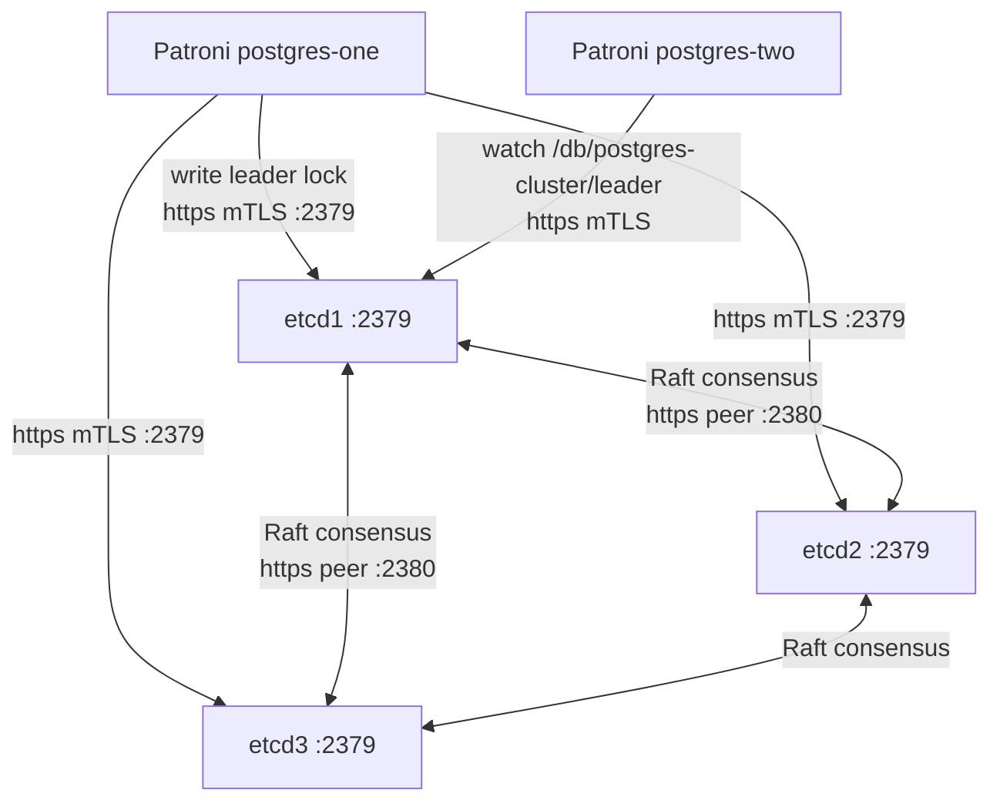

# etcd — Distributed Configuration Store

## Executive Summary

etcd is a highly available, strongly consistent key-value store used as the "brain" of the Patroni HA cluster. When multiple PostgreSQL instances compete to be the primary, etcd acts as the neutral arbiter. Only the instance that holds the "leader lock" key in etcd is allowed to accept writes. If the primary fails to renew its lock within 30 seconds, etcd deletes the lock and another member can acquire it and promote itself. This mechanism guarantees that there is always at most one primary — preventing the "split-brain" situation where two nodes both accept writes and diverge irreparably.

In this stack, etcd runs as a 3-node cluster (`etcd1`, `etcd2`, `etcd3`) with mutual TLS (mTLS) enabled for both client communications and peer communications between etcd nodes, ensuring all coordination traffic is encrypted.

## Why This Matters (Business / Compliance Context)

The etcd cluster is the single most critical availability dependency in this stack: without a quorum (2 of 3 nodes), Patroni cannot elect a leader, and the database cluster becomes read-only or unavailable. Running 3 etcd nodes on separate hosts (or availability zones) ensures that any single node failure does not interrupt cluster coordination. This is a foundational availability control (SOC 2 CC6, ISO 27001 A.17.1).

Mutual TLS on etcd ensures that only authorised participants (Patroni instances with valid certificates) can interact with cluster state — an important access-control measure for ISO 27001 A.9.

## Component Role in This Stack



## Version & Distribution

| Property        | Value                                                          |
|-----------------|----------------------------------------------------------------|
| Version         | v3.5.16 (`quay.io/coreos/etcd:v3.5.16`)                       |
| Source          | Quay.io / CoreOS upstream                                      |
| Install method  | Docker                                                          |
| Architecture    | aarch64 / x86_64                                               |
| Data directory  | `/etcd-data` (mounted as Docker volume `etcd1_data` etc.)      |
| Topology        | 3-node cluster — etcd1, etcd2, etcd3                          |

## Configuration

### `etcd/node1/docker-compose.yml`

```yaml
services:
  etcd1:
    image: quay.io/coreos/etcd:v3.5.16
    container_name: etcd1
    hostname: etcd1
    environment:
      - ETCD_NAME=etcd1

      # Peer URLs (node-to-node Raft replication)
      - ETCD_INITIAL_ADVERTISE_PEER_URLS=https://etcd1:2380
      - ETCD_LISTEN_PEER_URLS=https://0.0.0.0:2380

      # Client URLs (Patroni, etcdctl)
      - ETCD_LISTEN_CLIENT_URLS=https://0.0.0.0:2379
      - ETCD_ADVERTISE_CLIENT_URLS=https://etcd1:2379

      # Cluster bootstrap
      - ETCD_INITIAL_CLUSTER=etcd1=https://etcd1:2380,etcd2=https://etcd2:2380,etcd3=https://etcd3:2380
      - ETCD_INITIAL_CLUSTER_STATE=new
      - ETCD_INITIAL_CLUSTER_TOKEN=etcd-cluster-token

      # Client TLS — mTLS (client must present a valid certificate)
      - ETCD_CERT_FILE=/certs/public.crt
      - ETCD_KEY_FILE=/certs/private.key
      - ETCD_TRUSTED_CA_FILE=/certs/ca.crt
      - ETCD_CLIENT_CERT_AUTH=true

      # Peer TLS — mTLS (nodes must authenticate each other)
      - ETCD_PEER_CERT_FILE=/certs/public.crt
      - ETCD_PEER_KEY_FILE=/certs/private.key
      - ETCD_PEER_TRUSTED_CA_FILE=/certs/ca.crt
      - ETCD_PEER_CLIENT_CERT_AUTH=true

    ports:
      - "2379:2379"   # client
      - "2380:2380"   # peer

    volumes:
      - etcd1_data:/etcd-data
      - ./certs:/certs:ro

    healthcheck:
      test: ["CMD", "etcdctl",
             "--endpoints=https://etcd1:2379",
             "--cacert=/certs/ca.crt",
             "--cert=/certs/public.crt",
             "--key=/certs/private.key",
             "endpoint", "health"]
      interval: 10s
      timeout: 5s
      retries: 5
```

> **Note**: `etcd/node2/` and `etcd/node3/` contain identical compose files with `ETCD_NAME=etcd2` and `ETCD_NAME=etcd3` respectively.

### Patroni etcd3 Client Configuration (`patroni-one.yml`)

```yaml
etcd3:
  hosts:
    - etcd1:2379
    - etcd2:2379
    - etcd3:2379
  protocol: https
  cacert: /etc/postgres/certs/ca.crt        # Root CA to validate etcd server cert
  cert: /etc/postgres/certs/public.crt      # Patroni client certificate
  key: /etc/postgres/certs/private.key      # Patroni client private key
```

### Key Parameters Explained

| Parameter                       | Value Found         | Effect                                                                  | Recommendation                                         |
|---------------------------------|---------------------|-------------------------------------------------------------------------|--------------------------------------------------------|
| `ETCD_INITIAL_CLUSTER_STATE`    | new                 | Starts a fresh cluster; change to `existing` when adding nodes          | Reset to `new` only on first-ever bootstrap            |
| `ETCD_INITIAL_CLUSTER_TOKEN`    | etcd-cluster-token  | Unique token prevents cross-cluster member confusion                    | Use a unique value per environment                     |
| `ETCD_CLIENT_CERT_AUTH`         | true                | Requires clients to present a certificate (mTLS)                        | Always true for production                             |
| `ETCD_PEER_CLIENT_CERT_AUTH`    | true                | etcd nodes authenticate each other with certificates                    | Always true for production                             |
| `Patroni ttl`                   | 30 (seconds)        | etcd key TTL for leader lock                                            | Must be > `loop_wait * 3` to avoid false failovers     |
| Data volume                     | `etcd1_data`        | Persists etcd state across container restarts                           | Back up etcd data independently for DR                |

## Integration Points

| Component     | Integration                                                                                     |
|---------------|-------------------------------------------------------------------------------------------------|
| Patroni       | Reads and writes cluster state (leader lock, member config) via etcd3 API over mTLS            |
| TLS / Certs   | All certs generated by `scripts/generate_tls_cert.sh` sharing the same Root CA               |
| Docker network | All containers on `sg-prod-zone-1` external Docker bridge; DNS resolution by container hostname    |

## Known Issues & Research Findings

### TLS Certificate Misconfiguration is the #1 Failure Mode

During R&D (Research Cycle 1), the most common failure was "Patroni waiting for leader to bootstrap" caused by a TLS certificate mismatch. The symptoms:
- `curl --cacert ca.crt https://etcd1:2379/health` fails with certificate error
- Patroni logs show "etcd: connection refused" or "certificate verify failed"

**Checklist**:
1. All etcd nodes and Patroni use certificates signed by the **same Root CA**.
2. The SAN (Subject Alternative Name) on each etcd certificate includes `DNS:etcd1` (and localhost if needed).
3. Certificates are mounted read-only with correct file permissions (key: mode 600).

### Single-Node etcd (Development Shortcut)

The repository structure has separate `etcd/node1/`, `etcd/node2/`, `etcd/node3/` compose files, suggesting each can run on different hosts. In a local Docker development environment, all three may run on the same Docker host. In this case, port conflicts must be managed (each node needs different host ports).

### etcd Data Volume Cleanup on Bootstrap Reset

When resetting the cluster from scratch, leftover etcd data volumes cause bootstrap failures (`ETCD_INITIAL_CLUSTER_STATE=new` fails if the data directory already has an etcd member ID). Always `docker volume rm etcd1_data etcd2_data etcd3_data` before a fresh bootstrap.

## Operational Notes

```bash
# Health check for all nodes
for NODE in etcd1 etcd2 etcd3; do
  docker exec $NODE etcdctl \
    --endpoints=https://${NODE}:2379 \
    --cacert=/certs/ca.crt \
    --cert=/certs/public.crt \
    --key=/certs/private.key \
    endpoint health
done

# Check cluster member list
docker exec etcd1 etcdctl \
  --endpoints=https://etcd1:2379,https://etcd2:2379,https://etcd3:2379 \
  --cacert=/certs/ca.crt \
  --cert=/certs/public.crt \
  --key=/certs/private.key \
  member list

# View Patroni's key in etcd
docker exec etcd1 etcdctl \
  --endpoints=https://etcd1:2379 \
  --cacert=/certs/ca.crt \
  --cert=/certs/public.crt \
  --key=/certs/private.key \
  get /db/postgres-cluster/ --prefix

# Check which node holds the leader lock
docker exec etcd1 etcdctl \
  --endpoints=https://etcd1:2379 \
  --cacert=/certs/ca.crt \
  --cert=/certs/public.crt \
  --key=/certs/private.key \
  get /db/postgres-cluster/leader
```

## Performance Considerations

- etcd is latency-sensitive; it must respond to Patroni heartbeats within `ttl = 30s`. On high-latency networks, increase `ttl` and `loop_wait` proportionally.
- etcd stores only small keys (Patroni config, leader lock). Its storage footprint is minimal. However, `etcd-data` volumes must be on fast, reliable storage (SSD recommended) to maintain Raft commit latency below 50ms.
- Quorum requires 2 of 3 nodes. Losing 2 nodes simultaneously causes cluster unavailability. For production, distribute across failure domains (different hosts/AZs).

## References & Further Reading

- [etcd Documentation v3.5](https://etcd.io/docs/v3.5/)
- [etcd Security / TLS](https://etcd.io/docs/v3.5/op-guide/security/)
- [Patroni with etcd3](https://patroni.readthedocs.io/en/latest/etcd.html)
- [etcd Raft Consensus](https://etcd.io/docs/v3.5/learning/design-learner/)
- [scripts/generate_tls_cert.sh](../../scripts/generate_tls_cert.sh)
