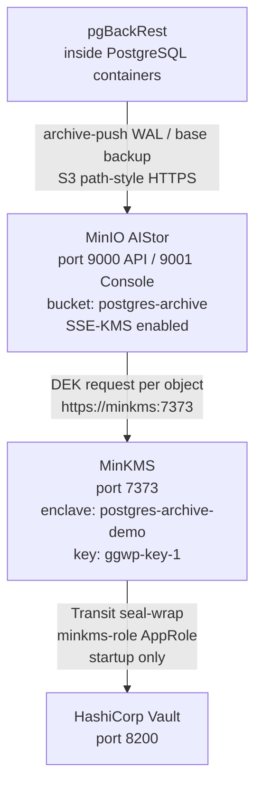

# MinIO AIStor / MinKMS — Object Storage and Key Management

## Executive Summary

MinIO AIStor is an enterprise-grade object storage system compatible with Amazon S3's API. In this stack, it serves as the backup repository where PostgreSQL's WAL segments and base backups are stored by pgBackRest. Every object written to MinIO is automatically encrypted with Server-Side Encryption (SSE-KMS), using keys managed by MinKMS.

MinKMS is MinIO's dedicated Key Management Server. It manages encryption keys in isolated **enclaves** (logical namespaces) and wraps its own root seal key using **HashiCorp Vault's Transit secret engine** — meaning MinKMS's master key never exists in plaintext on disk. Together, MinIO AIStor + MinKMS + Vault provide a layered defence-in-depth: object storage encryption (SSE-KMS) on top of the PostgreSQL-level pg_tde encryption.

## Why This Matters (Business / Compliance Context)

Storing unencrypted database backups in object storage is a significant compliance risk: a misconfigured bucket policy could expose the entire backup to the internet. SSE-KMS on MinIO means that even if bucket access control fails, the underlying objects are encrypted. This addresses:

| Framework  | Control                                                      |
|------------|--------------------------------------------------------------|
| ISO 27001  | A.10.1 — Cryptographic controls; A.12.3 — Backup            |
| GDPR       | Article 32 — Encryption of personal data in backups         |
| PCI-DSS    | Requirement 3.5 — Protect stored cardholder data            |

## Component Role in This Stack



## Version & Distribution

| Component   | Property        | Value                                                |
|-------------|-----------------|------------------------------------------------------|
| MinIO AIStor| Image           | `quay.io/minio/aistor/minio:latest`                  |
| MinIO AIStor| License         | Enterprise (requires `minio.license` file)           |
| MinKMS      | Image           | `quay.io/minio/aistor/minkms:latest`                 |
| Both        | Architecture    | aarch64 / x86_64                                     |
| Both        | Install method  | Docker Compose                                       |

## Configuration

### MinIO AIStor (`minio/aistor/docker-compose.yml`)

```yaml
services:
  minio:
    image: quay.io/minio/aistor/minio:latest
    container_name: minio
    hostname: minio
    ports:
      - "9000:9000"   # S3 API
      - "9001:9001"   # Web Console
    volumes:
      - minio_data:/mnt/data
      - ./certs:/root/.minio/certs        # TLS certificates for MinIO HTTPS
      - ./license/minio.license:/minio.license
    environment:
      - MINIO_KMS_SERVER=https://minkms:7373  # MinKMS endpoint
      - MINIO_KMS_API_KEY=k2:J-VCH_j6egEqkxRpgG6LTikvb2X2I1nyIoaB0wRD-P8  # API key for MinKMS auth
      - MINIO_KMS_SSE_KEY=postgres-arch-sample-key-123  # default SSE key name
      - MINIO_KMS_ENCLAVE=postgres-arch               # logical KMS enclave / namespace
    command: ["server", "/mnt/data", "--license", "/minio.license"]
    healthcheck:
      test: ["CMD", "curl", "-fk", "https://localhost:9000/minio/health/live"]
      interval: 30s
      timeout: 20s
      retries: 3
```

> **Note:** `MINIO_KMS_API_KEY` is the **client** API key for the `postgres-archive-demo` enclave (prefix `k2:`). This is different from the MinKMS **server** API key (prefix `k1:`) shown in MinKMS logs. See the enclave setup section below.

### MinKMS (`minio/minkms/docker-compose.yml`)

```yaml
services:
  minkms:
    image: quay.io/minio/aistor/minkms:latest
    container_name: minkms
    hostname: minkms
    # Vault must be running and unsealed before MinKMS starts
    external_links:
      - vault
    ports:
      - "7373:7373"     # KMS API (HTTPS)
    volumes:
      - minkms_data:/mnt/minio-kms
      - ./certs:/etc/minkms/certs
      - ./config.yaml:/etc/minkms/config.yaml
    environment:
      - TZ=Asia/Jakarta
      - MINIO_KMS_VOLUME=/mnt/minio-kms
    command: ["server", "--config", "/etc/minkms/config.yaml", "/mnt/minio-kms"]
```

### MinKMS Full Configuration (`minio/minkms/config.yaml`)

```yaml
version: v1
tls:
  certs:
  - key: /etc/minkms/certs/private.key
    cert: /etc/minkms/certs/public.crt

# HSM: root seal key is wrapped/unwrapped by Vault Transit at startup only.
# MinKMS cannot start if Vault is sealed or unreachable.
hsm:
  hashicorp:
    vault:
      server: "http://vault:8200"
      approle:
        id: "<role_id>"       # from: vault read auth/approle/role/minkms-role/role-id
        secret: "<secret_id>" # from: vault write -f auth/approle/role/minkms-role/secret-id
      transit:
        engine: "transit"
        key: "minkms-sealing-key"
```

### pgBackRest Bucket Policy (`minio/pgbackrest-policy.json`)

```json
{
  "Version": "2012-10-17",
  "Statement": [
    {
      "Effect": "Allow",
      "Action": ["s3:ListBucket", "s3:GetBucketLocation"],
      "Resource": ["arn:aws:s3:::postgres-archive"]
    },
    {
      "Effect": "Allow",
      "Action": ["s3:GetObject", "s3:PutObject", "s3:DeleteObject"],
      "Resource": ["arn:aws:s3:::postgres-archive/*"]
    }
  ]
}
```

### MinKMS Enclave Setup (`minio/minkms/setup_enclave.txt`)

After MinKMS starts, create the enclave and SSE key that MinIO AIStor will use. Requires the `minkms` CLI binary (download from MinIO) or run via `docker run`.

```bash
# Use the server API Key shown in MinKMS startup logs (k1:...)
export MINIO_KMS_SERVER=https://localhost:7373
export MINIO_KMS_API_KEY=k1:<server_api_key_from_logs>

# 1. Verify MinKMS is reachable
minkms stat -k

# 2. Create the enclave (logical namespace for this MinIO instance)
minkms add-enclave -k postgres-archive-demo

# 3. Create an admin identity for MinIO AIStor inside the enclave
minkms add-identity -k --enclave postgres-archive-demo --admin

# 4. Get the client API Key for MinIO AIStor (k2:... prefix)
minkms get-identity -k --enclave postgres-archive-demo --admin
# → Copy this k2:... value → set as MINIO_KMS_API_KEY in minio/aistor/docker-compose.yml

# 5. Create the SSE key used for object encryption
minkms keygen --insecure --enclave postgres-archive-demo ggwp-key-1
# → Set MINIO_KMS_SSE_KEY=ggwp-key-1 in minio/aistor/docker-compose.yml
```

After updating docker-compose.yml, restart MinIO:
```bash
make down-minio && make up-minio
```

### pgBackRest Bucket Setup (`minio/setup_bucket.md`)

```bash
# Connect mc client to MinIO
mc alias set myminio https://localhost:9000 minioadmin minioadmin --insecure

# Create the backup bucket
mc mb myminio/postgres-archive --insecure
mc anonymous set none myminio/postgres-archive --insecure

# Create pgbackrest user + policy
mc admin user add myminio pgbackrest <password> --insecure
mc admin policy create myminio pgbackrest-policy minio/pgbackrest-policy.json --insecure
mc admin policy attach myminio pgbackrest-policy --user=pgbackrest --insecure

# Verify
mc admin user list myminio --insecure
# Expected: enabled  pgbackrest  pgbackrest-policy
```

See `minio/setup_bucket.md` for full step-by-step with expected output.

### Key Parameters Explained

| Parameter                    | Value Found                              | Effect                                                                  | Recommendation                                 |
|------------------------------|------------------------------------------|-------------------------------------------------------------------------|------------------------------------------------|
| `MINIO_KMS_SERVER`           | `https://minkms:7373`                    | MinIO connects to MinKMS for SSE operations                             | Ensure MinKMS is healthy before MinIO starts   |
| `MINIO_KMS_SSE_KEY`          | `postgres-arch-sample-key-123`           | Name of the SSE key used for object encryption                          | Rotate key name after initial setup            |
| `MINIO_KMS_ENCLAVE`          | `postgres-arch`                          | Logical namespace in MinKMS for key isolation                           | Use one enclave per logical data domain        |
| `MINIO_KMS_HSM_KEY`          | `hsm:aes256:...` (base64 AES key)        | Master key that wraps all MinKMS DEKs                                   | Store in a hardware HSM or Vault in production |
| `repo1-s3-uri-style`         | `path` (in pgbackrest.conf)              | S3 path-style requests (required for non-AWS S3 endpoints)              | Required for MinIO                             |
| `repo1-storage-verify-tls`   | `n` (disabled)                           | TLS verification disabled — workaround for self-signed certs            | Enable with `repo1-storage-ca-file` in production |

## Integration Points

| Component        | Integration                                                                                              |
|------------------|----------------------------------------------------------------------------------------------------------|
| pgBackRest       | Pushes WAL and base backups to `postgres-archive` bucket via S3 path-style HTTPS                         |
| MinKMS           | MinIO calls MinKMS for every object write/read to perform SSE-KMS encryption (`ggwp-key-1` in enclave `postgres-archive-demo`) |
| **HashiCorp Vault** | **Implemented** — MinKMS authenticates via AppRole `minkms-role` at startup; Vault Transit wraps the MinKMS root seal key |
| TLS Certs        | MinIO and MinKMS each have their own self-signed TLS certs (shared Root CA)                               |
| region_singapore_net       | All containers on external Docker bridge `region_singapore_net` for hostname DNS resolution                         |

## Known Issues & Research Findings

### MinIO AIStor Requires a Commercial License

`quay.io/minio/aistor/minio:latest` requires a valid `minio.license` file. Without it, the container starts but features like SSE-KMS and the enterprise console may be restricted. The license file is mounted at `/minio.license` on the container.

### `repo1-storage-verify-tls=n` is a Security Risk

pgBackRest's `pgbackrest.conf` includes `repo1-storage-verify-tls=n`, which disables TLS certificate verification for the S3 connection to MinIO. This was used in R&D because MinIO uses a self-signed certificate. In production, set `repo1-storage-ca-file=/etc/postgres/certs/ca.crt` and remove the `verify-tls=n` line.

### MinKMS Startup Depends on Vault

MinKMS uses Vault Transit to unseal its root key at startup. If Vault is sealed or unreachable when MinKMS starts, MinKMS will fail to start. The required startup order is: **Vault (unsealed) → MinKMS → MinIO AIStor**. Once MinKMS is running, Vault can go down without affecting ongoing object encryption/decryption (the root key is in memory). See `docs/operations/cluster-setup-order.md`.

### MinKMS API Key Changes After Re-seal

After rotating the Vault Transit key and restarting MinKMS, MinKMS generates a **new server API Key** (`k1:...`). The client API Key for MinIO (`k2:...`, scoped to the enclave) does **not** change automatically. Only the server identity key changes. Verify via `make logs-minkms | grep 'API Key'`.

### Key Rotation for MinIO Objects (Vault vs. MinKMS)

It is crucial to understand the distinct rotation mechanisms in this stack:

1. **Vault Transit Key Rotation (`minkms-sealing-key`)**: 
   - Rotating this key *only* re-wraps the MinKMS root seal key upon the next MinKMS restart.
   - It **does not** re-encrypt existing WAL or backup objects in MinIO.

2. **MinKMS Enclave Key Rotation (e.g., `ggwp-key-1`)**:
   - Rotating the active SSE Key creates a new key version inside MinKMS.
   - New objects written by pgBackRest will have their per-object DEKs wrapped by the *new* key version.
   - **Existing objects are untouched.** Their DEKs remain wrapped by the *old* key version.

**Re-encrypting Existing Data:**
To strictly re-encrypt existing data (so old key versions can be destroyed), you must execute:
`mc admin heal myminio/postgres-archive --recursive --insecure`

This process is highly efficient on storage I/O because it **only re-wraps the object metadata** (the encrypted DEK) and does not read or rewrite the actual 1TB backup payload. However, because it issues two API calls to MinKMS per object, healing a bucket with tens of thousands of WAL segments can incur heavy network and MinKMS CPU overhead.

**Operational Recommendation:**
Instead of running expensive healing operations across the whole bucket, align your KMS rotation schedule with your pgBackRest retention policy. For instance, if old backups and WAL segments expire after 30 days, a 90-day KMS key rotation naturally ages out all data encrypted by the old key. Once pgBackRest retention purges all objects using the old key version, the old KMS key version can be safely destroyed without ever needing to "heal" the bucket.

## Operational Notes

```bash
# Check MinIO health
curl -fk https://localhost:9000/minio/health/live

# Check MinKMS health
curl -sk https://localhost:7373/v1/status | jq .

# List buckets via mc (MinIO client)
mc alias set myminio https://localhost:9000 <ACCESS_KEY> <SECRET_KEY> --insecure
mc ls myminio

# Check SSE status of objects in bucket
mc stat myminio/postgres-archive/<path> --insecure

# View pgBackRest backup info
docker exec postgres-one pgbackrest --stanza=postgres-patroni-tde info
```

## Performance Considerations

- SSE-KMS adds a network round-trip to MinKMS for every object written and read. For high-throughput WAL archiving, MinKMS should run on a low-latency, reliable connection to MinIO.
- Large base backups (multi-GB) are compressed by pgBackRest (lz4) before being sent to MinIO, reducing both transfer time and storage cost.
- MinIO supports erasure coding for data redundancy, but this is not configured in the single-node Docker R&D setup.

## References & Further Reading

- [MinIO AIStor Documentation](https://min.io/docs/minio/linux/index.html)
- [MinIO KMS / MinKMS](https://min.io/docs/minio/linux/operations/server-side-encryption.html)
- [MinIO pgBackRest Integration](https://pgbackrest.org/user-guide.html#s3-compatible)
- [MinIO Bucket Policies](https://min.io/docs/minio/linux/administration/identity-access-management/policy-based-access-control.html)
- [minio/setup_bucket.md](../../minio/setup_bucket.md)
