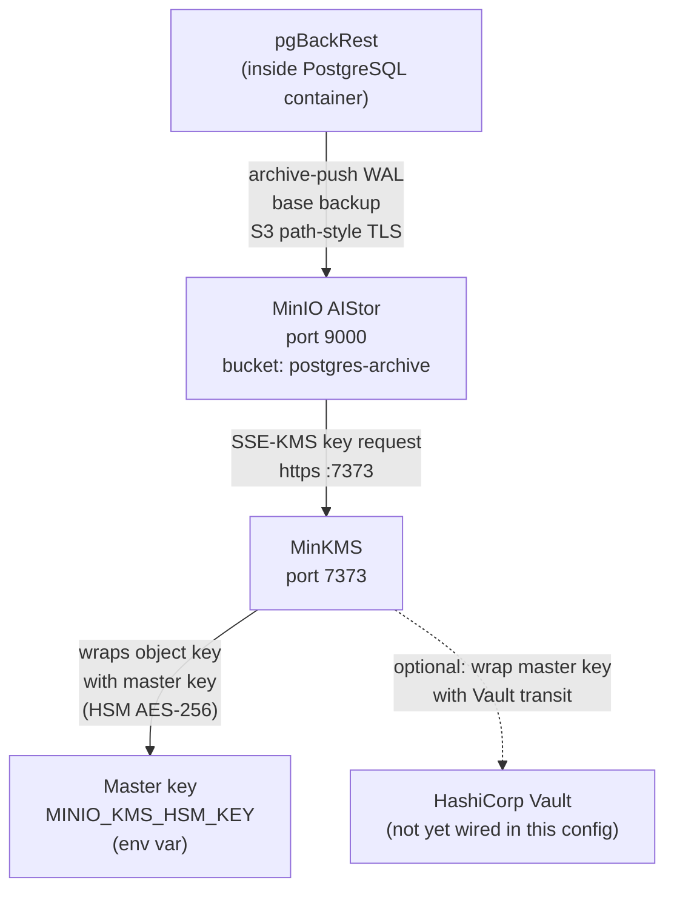

# MinIO AIStor / MinKMS — Object Storage and Key Management

## Executive Summary

MinIO AIStor is an enterprise-grade object storage system compatible with Amazon S3's API. In this stack, it serves as the backup repository where PostgreSQL's WAL segments and base backups are stored by pgBackRest. In addition to storage, MinIO is configured with Server-Side Encryption (SSE-KMS), meaning every object written to a bucket is automatically encrypted using keys managed by MinKMS — MinIO's own Key Management Server.

MinKMS is a lightweight KMS specifically designed for MinIO. It receives encryption and decryption requests from MinIO, manages encryption keys internally, and in this stack is further secured by a hardware-style master key. Together, MinIO AIStor and MinKMS ensure that backup data at rest is encrypted independently of the PostgreSQL-level pg_tde encryption, providing a defence-in-depth posture.

## Why This Matters (Business / Compliance Context)

Storing unencrypted database backups in object storage is a significant compliance risk: a misconfigured bucket policy could expose the entire backup to the internet. SSE-KMS on MinIO means that even if bucket access control fails, the underlying objects are encrypted. This addresses:

| Framework  | Control                                                      |
|------------|--------------------------------------------------------------|
| ISO 27001  | A.10.1 — Cryptographic controls; A.12.3 — Backup            |
| GDPR       | Article 32 — Encryption of personal data in backups         |
| PCI-DSS    | Requirement 3.5 — Protect stored cardholder data            |

## Component Role in This Stack



## Version & Distribution

| Component   | Property        | Value                                                |
|-------------|-----------------|------------------------------------------------------|
| MinIO AIStor| Image           | `quay.io/minio/aistor/minio:latest`                  |
| MinIO AIStor| License         | Enterprise (requires `minio.license` file)           |
| MinKMS      | Image           | `quay.io/minio/aistor/minkms:latest`                 |
| Both        | Architecture    | aarch64 / x86_64                                     |
| Both        | Install method  | Docker Compose                                       |

## Configuration

### MinIO AIStor (`minio/aistor/docker-compose.yml`)

```yaml
services:
  minio:
    image: quay.io/minio/aistor/minio:latest
    container_name: minio
    hostname: minio
    ports:
      - "9000:9000"   # S3 API
      - "9001:9001"   # Web Console
    volumes:
      - minio_data:/mnt/data
      - ./certs:/root/.minio/certs        # TLS certificates for MinIO HTTPS
      - ./license/minio.license:/minio.license
    environment:
      - MINIO_KMS_SERVER=https://minkms:7373  # MinKMS endpoint
      - MINIO_KMS_API_KEY=k2:J-VCH_j6egEqkxRpgG6LTikvb2X2I1nyIoaB0wRD-P8  # API key for MinKMS auth
      - MINIO_KMS_SSE_KEY=postgres-arch-sample-key-123  # default SSE key name
      - MINIO_KMS_ENCLAVE=postgres-arch               # logical KMS enclave / namespace
    command: ["server", "/mnt/data", "--license", "/minio.license"]
    healthcheck:
      test: ["CMD", "curl", "-fk", "https://localhost:9000/minio/health/live"]
      interval: 30s
      timeout: 20s
      retries: 3
```

### MinKMS (`minio/minkms/docker-compose.yml`)

```yaml
services:
  minkms:
    image: quay.io/minio/aistor/minkms:latest
    container_name: minkms
    hostname: minkms
    ports:
      - "7373:7373"     # KMS API (HTTPS)
    volumes:
      - minkms_data:/mnt/minio-kms       # KMS key store
      - ./certs:/etc/minkms/certs        # TLS certs for MinKMS HTTPS
      - ./config.yaml:/etc/minkms/config.yaml
    env_file:
      - minkms.env
    command: ["server", "--config", "/etc/minkms/config.yaml", "/mnt/minio-kms"]
```

### MinKMS TLS Configuration (`minio/minkms/config.yaml`)

```yaml
version: v1
tls:
  certs:
    - key: /etc/minkms/certs/private.key
      cert: /etc/minkms/certs/public.crt
```

### MinKMS Master Key (`minio/minkms/minkms.env`)

```bash
# AES-256 HSM-style master key used to wrap all MinKMS object encryption keys
MINIO_KMS_HSM_KEY=hsm:aes256:wSyobDalkj3Qf08u2lKktXxyEru6RXiFGFdkOSQZ0ms=
MINIO_KMS_VOLUME=/mnt/minio-kms
```

### pgBackRest Bucket Policy (`minio/pgbackrest-policy.json`)

```json
{
  "Version": "2012-10-17",
  "Statement": [
    {
      "Effect": "Allow",
      "Action": ["s3:ListBucket", "s3:GetBucketLocation"],
      "Resource": ["arn:aws:s3:::postgres-archive"]
    },
    {
      "Effect": "Allow",
      "Action": ["s3:GetObject", "s3:PutObject", "s3:DeleteObject"],
      "Resource": ["arn:aws:s3:::postgres-archive/*"]
    }
  ]
}
```

### MinIO Bucket Setup References

```bash
# See minio/setup_bucket.md for the full step-by-step bucket creation:
# 1. Create access key 'pgbackrest' in MinIO Console
# 2. Create bucket 'postgres-archive'
# 3. Apply pgbackrest-policy.json to the pgbackrest access key
```

### Key Parameters Explained

| Parameter                    | Value Found                              | Effect                                                                  | Recommendation                                 |
|------------------------------|------------------------------------------|-------------------------------------------------------------------------|------------------------------------------------|
| `MINIO_KMS_SERVER`           | `https://minkms:7373`                    | MinIO connects to MinKMS for SSE operations                             | Ensure MinKMS is healthy before MinIO starts   |
| `MINIO_KMS_SSE_KEY`          | `postgres-arch-sample-key-123`           | Name of the SSE key used for object encryption                          | Rotate key name after initial setup            |
| `MINIO_KMS_ENCLAVE`          | `postgres-arch`                          | Logical namespace in MinKMS for key isolation                           | Use one enclave per logical data domain        |
| `MINIO_KMS_HSM_KEY`          | `hsm:aes256:...` (base64 AES key)        | Master key that wraps all MinKMS DEKs                                   | Store in a hardware HSM or Vault in production |
| `repo1-s3-uri-style`         | `path` (in pgbackrest.conf)              | S3 path-style requests (required for non-AWS S3 endpoints)              | Required for MinIO                             |
| `repo1-storage-verify-tls`   | `n` (disabled)                           | TLS verification disabled — workaround for self-signed certs            | Enable with `repo1-storage-ca-file` in production |

## Integration Points

| Component     | Integration                                                                                        |
|---------------|----------------------------------------------------------------------------------------------------|
| pgBackRest    | Pushes WAL and base backups to bucket `postgres-archive` via S3 API (path-style)                   |
| MinKMS        | MinIO calls MinKMS for every object write/read to perform SSE-KMS encryption                       |
| HashiCorp Vault | [TO BE CONFIRMED: MinKMS → Vault wiring not found in config files; currently using local HSM key] |
| TLS Certs     | MinIO and MinKMS each have their own TLS certs generated from the same Root CA                     |
| pg_network    | All containers on external Docker bridge `pg_network` for container hostname DNS resolution         |

## Known Issues & Research Findings

### MinIO AIStor Requires a Commercial License

`quay.io/minio/aistor/minio:latest` requires a valid `minio.license` file. Without it, the container starts but features like SSE-KMS and the enterprise console may be restricted. The license file is mounted at `/minio.license` on the container.

### `repo1-storage-verify-tls=n` is a Security Risk

pgBackRest's `pgbackrest.conf` includes `repo1-storage-verify-tls=n`, which disables TLS certificate verification for the S3 connection to MinIO. This was used in R&D because MinIO uses a self-signed certificate. In production, set `repo1-storage-ca-file=/etc/postgres/certs/ca.crt` and remove the `verify-tls=n` line.

### MinKMS → Vault Integration Not Yet Wired

The `config.yaml` for MinKMS only defines TLS settings. The Vault-backed master key integration (where MinKMS would use Vault Transit to wrap its internal keys) is not yet configured in this R&D environment. All MinKMS keys are currently protected by the `MINIO_KMS_HSM_KEY` AES-256 key stored as an environment variable — this should be moved to Vault or an HSM for production.

### Key Rotation for MinIO Objects

Research Cycle 2 (RC2-01, RC2-02) focused on key rotation. After rotating the `MINIO_KMS_SSE_KEY`, existing objects retain their old DEK (which is wrapped with the old master key). To re-encrypt existing objects with the new key, MinIO provides a `mc admin heal` operation or `mc encrypt` re-encryption. See `docs/operations/key-rotation-runbook.md` for the procedure.

## Operational Notes

```bash
# Check MinIO health
curl -fk https://localhost:9000/minio/health/live

# Check MinKMS health
curl -sk https://localhost:7373/v1/status | jq .

# List buckets via mc (MinIO client)
mc alias set myminio https://localhost:9000 <ACCESS_KEY> <SECRET_KEY> --insecure
mc ls myminio

# Check SSE status of objects in bucket
mc stat myminio/postgres-archive/<path> --insecure

# View pgBackRest backup info
docker exec postgres-one pgbackrest --stanza=postgres-patroni-tde info
```

## Performance Considerations

- SSE-KMS adds a network round-trip to MinKMS for every object written and read. For high-throughput WAL archiving, MinKMS should run on a low-latency, reliable connection to MinIO.
- Large base backups (multi-GB) are compressed by pgBackRest (lz4) before being sent to MinIO, reducing both transfer time and storage cost.
- MinIO supports erasure coding for data redundancy, but this is not configured in the single-node Docker R&D setup.

## References & Further Reading

- [MinIO AIStor Documentation](https://min.io/docs/minio/linux/index.html)
- [MinIO KMS / MinKMS](https://min.io/docs/minio/linux/operations/server-side-encryption.html)
- [MinIO pgBackRest Integration](https://pgbackrest.org/user-guide.html#s3-compatible)
- [MinIO Bucket Policies](https://min.io/docs/minio/linux/administration/identity-access-management/policy-based-access-control.html)
- [minio/setup_bucket.md](../../minio/setup_bucket.md)
