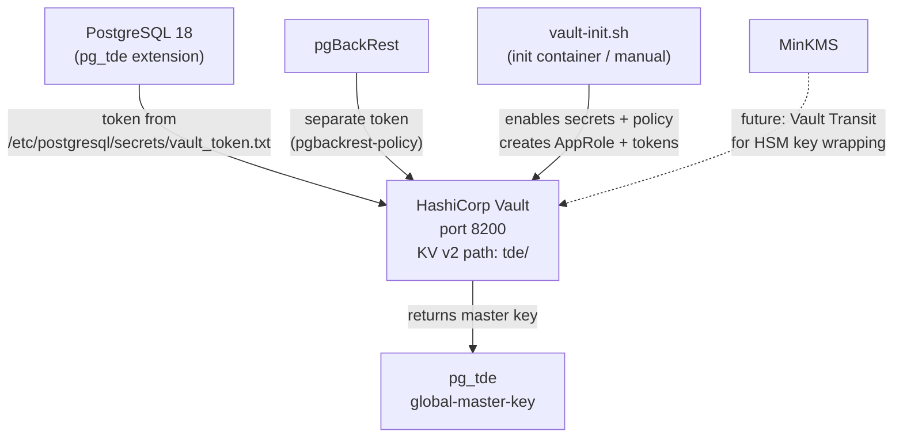

# HashiCorp Vault — Secrets Management

## Executive Summary

HashiCorp Vault is a purpose-built secrets management system that stores, generates, and controls access to sensitive data such as encryption keys, API tokens, and certificates. In this stack, Vault has two primary roles: (1) it is the **key provider for pg_tde**, storing the PostgreSQL master encryption key that protects all data at rest, and (2) it mints **short-lived tokens** for other services (PostgreSQL, pgBackRest) so they can authenticate to Vault without storing long-lived passwords.

Vault uses the AppRole authentication method, which is designed for machine-to-machine authentication. Each service gets its own role with minimal required permissions — a PostgreSQL node can only read and write encryption keys, nothing else.

## Why This Matters (Business / Compliance Context)

Storing encryption keys alongside the encrypted data is a fundamental security anti-pattern. If an attacker gains access to the PostgreSQL data directory, they should not be able to also find the key needed to decrypt it. Vault solves this by placing the key in a separate, independently secured system with its own access controls, audit logs, and key rotation capabilities. This is required by:

| Framework  | Control                                                      |
|------------|--------------------------------------------------------------|
| ISO 27001  | A.10.1.2 — Key management                                    |
| PCI-DSS    | Requirement 3.6 — Document key management procedures        |
| GDPR       | Article 32 — Encryption of personal data with managed keys  |
| SOC 2      | CC6.1 — Logical access encryption key management            |

## Component Role in This Stack



## Version & Distribution

| Property        | Value                                   |
|-----------------|-----------------------------------------|
| Version         | 1.21 (`hashicorp/vault:1.21`)           |
| Source          | HashiCorp Docker Hub                    |
| Install method  | Docker                                  |
| Architecture    | aarch64 / x86_64                        |
| Storage backend | File (`/vault/file`)                    |
| API address     | `http://vault:8200` (TLS disabled in R&D) |
| UI              | Enabled (`"ui": true`)                  |

## Configuration

### `vault/docker-compose.yml`

```yaml
services:
  vault:
    image: hashicorp/vault:1.21
    container_name: vault
    hostname: vault
    ports:
      - "8200:8200"
    cap_add:
      - IPC_LOCK      # prevents Vault from being swapped to disk (security)
    volumes:
      - vault_data:/vault/file    # persistent storage for Vault data
    environment:
      VAULT_ADDR: http://vault:8200
      VAULT_LOCAL_CONFIG: |
        {
          "storage": {
            "file": { "path": "/vault/file" }
          },
          "listener": [
            { "tcp": { "address": "vault:8200", "tls_disable": true } }
          ],
          "default_lease_ttl": "168h",    # 7 days
          "max_lease_ttl": "720h",        # 30 days
          "disable_mlock": false,
          "ui": true,
          "api_addr": "http://vault:8200"
        }
    command: server
```

### Vault Initialisation Script (`vault/custom/vault-init.sh`)

```bash
#!/bin/sh
export VAULT_ADDR="http://vault:8200"

# 1. Enable KV v2 secret engine at path 'tde'
vault secrets enable -path=tde -version=2 kv

# 2. Write the pg_tde access policy
vault policy write pg_tde-policy - <<EOF
path "pg_tde/data/*" {
  capabilities = ["read", "create", "update", "list"]
}
path "pg_tde/metadata/*" {
  capabilities = ["read", "list"]
}
path "sys/mounts/*" {
  capabilities = ["read"]
}
EOF

# 3. Enable AppRole authentication
vault auth enable approle
vault write auth/approle/role/tde-role policies="tde-policy"

# 4. Generate a token for PostgreSQL's pg_tde extension
TDE_TOKEN=$(vault token create -policy="tde-policy" -field=token)
echo "$TDE_TOKEN" > /vault/secrets/vault_token.txt
chmod 600 /vault/secrets/vault_token.txt

# 5. Generate a separate token for pgBackRest
PGBACKREST_TOKEN=$(vault token create -policy="pgbackrest-policy" -field=token)
echo "$PGBACKREST_TOKEN" > /vault/secrets/pgbackrest_vault_token.txt
chmod 600 /vault/secrets/pgbackrest_vault_token.txt
```

### Manual Setup Steps (`vault/custom/setup_postgres_tde.txt`)

```bash
# Step-by-step for interactive setup
vault secrets enable -path=pg_tde -version=2 kv

vault policy write pg_tde-policy - <<EOF
path "pg_tde/data/*" {
  capabilities = ["read", "create", "update", "list"]
}
path "pg_tde/metadata/*" {
  capabilities = ["read", "list"]
}
path "sys/mounts/*" {
  capabilities = ["read"]
}
EOF

vault auth enable approle
vault write auth/approle/role/tde-role policies="pg_tde-policy"

# Generate a long-lived token (1 year)
vault token create -policy="pg_tde-policy" -ttl=8760h -field=token
# Example output: hvs.CAESIN_Yz7OUPKM6Nv6QuDCf8z4ot91QoCPx72BXn5z5u...
```

### Key Parameters Explained

| Parameter              | Value Found            | Effect                                                                   | Recommendation                                            |
|------------------------|------------------------|--------------------------------------------------------------------------|-----------------------------------------------------------|
| Storage backend        | `file`                 | Stores Vault data on the local filesystem volume                         | Use Raft (integrated) or Consul for production HA         |
| `tls_disable`          | true                   | No TLS on Vault listener — all traffic is plaintext                      | **Enable TLS in production** with a proper certificate    |
| `default_lease_ttl`    | 168h (7 days)          | Service tokens expire after 7 days unless renewed                        | Reduce for higher security; implement token renewal       |
| `max_lease_ttl`        | 720h (30 days)         | Hard maximum for all leases                                               | Match your security policy                               |
| `disable_mlock`        | false                  | Vault locks memory pages to prevent sensitive data swapping              | Always false in production                                |
| KV path (pg_tde)       | `tde/` or `pg_tde/`   | Secret engine mount path used by pg_tde                                  | Be consistent; mount path in vault must match pg_tde config |
| Token file path        | `/etc/postgresql/secrets/vault_token.txt` (mode 600) | Token read by pg_tde for API authentication | Rotate before `default_lease_ttl` → set shorter TTL |

## Integration Points

| Component     | Integration                                                                                     |
|---------------|-------------------------------------------------------------------------------------------------|
| pg_tde        | Reads Vault token from file; calls KV v2 API to store and retrieve the master encryption key    |
| pgBackRest    | Separate Vault token (`pgbackrest-policy`) for reading S3 credentials [TO BE CONFIRMED: vault-pgbackrest integration not explicitly shown in pgbackrest.conf] |
| MinKMS        | Planned but NOT yet implemented: MinKMS would use Vault Transit to wrap its HSM master key      |
| Docker secrets | Vault token is read from a file mounted into the PostgreSQL container at `./vault_token.txt`  |

## Known Issues & Research Findings

### TLS Disabled — Production Risk

The Vault server in this R&D environment uses `tls_disable: true` for simplicity. All token material and key data flows over unencrypted HTTP within the Docker network. While the Docker overlay network provides some isolation, this is not acceptable for production deployment.

### File Storage Backend — Not HA

The `file` storage backend does not support Vault High Availability. If the Vault container restarts, Vault must be manually unsealed (using the unseal keys in `vault/custom/vault-seal.json`). For production, use Raft integrated storage with automatic unseal (AWS KMS, GCP KMS, or Azure Key Vault).

### KV Mount Path Inconsistency

The `vault-init.sh` script mounts the KV engine at path `tde/`, while the `setup_postgres_tde.txt` manual instructions use path `pg_tde/`. The `postgres_setup.docker.sh` script uses `pg_tde` as the mount path. [TO BE CONFIRMED: verify which path is actually live by running `vault secrets list` inside the vault container.]

### Token Expiry is Not Monitored

Vault tokens generated with `-ttl=8760h` (1 year) will expire silently. When the token expires, pg_tde will fail to fetch decryption keys on the next server restart, potentially causing the cluster to fail to start. Implement token renewal via `vault token renew` via a cron job or Vault Agent.

## Operational Notes

```bash
# Access Vault inside Docker
docker exec -it vault sh
export VAULT_TOKEN=<root_or_admin_token>
export VAULT_ADDR=http://vault:8200

# Check Vault status
vault status

# List enabled secret engines
vault secrets list

# List enabled auth methods
vault auth list

# Check token validity
vault token lookup <token>

# List keys in pg_tde KV store
vault kv list tde/

# View a specific key
vault kv get tde/global-master-key

# Renew a token (run before expiry)
vault token renew <token>

# Re-init Vault if container was restarted and token is lost
docker exec vault sh /vault/config/vault-init.sh
```

## Performance Considerations

- pg_tde does **not** call Vault on every query. The master key is fetched once at startup and cached in PostgreSQL shared memory. Vault latency only affects startup time and key rotation events.
- Vault's file backend has no inherent performance limit for this use case (< 1 request/minute expected from PostgreSQL). The bottleneck is always the etcd or PostgreSQL layer.
- For high-volume environments where many containers each call Vault at startup, use Vault Agent with response caching to reduce load on the Vault server.

## References & Further Reading

- [HashiCorp Vault Documentation](https://developer.hashicorp.com/vault/docs)
- [Vault KV v2 Secrets Engine](https://developer.hashicorp.com/vault/docs/secrets/kv/kv-v2)
- [Vault AppRole Auth Method](https://developer.hashicorp.com/vault/docs/auth/approle)
- [pg_tde Vault Integration](https://docs.percona.com/pg-tde/key-management/vault.html)
- [vault/custom/vault-init.sh](../../vault/custom/vault-init.sh)
