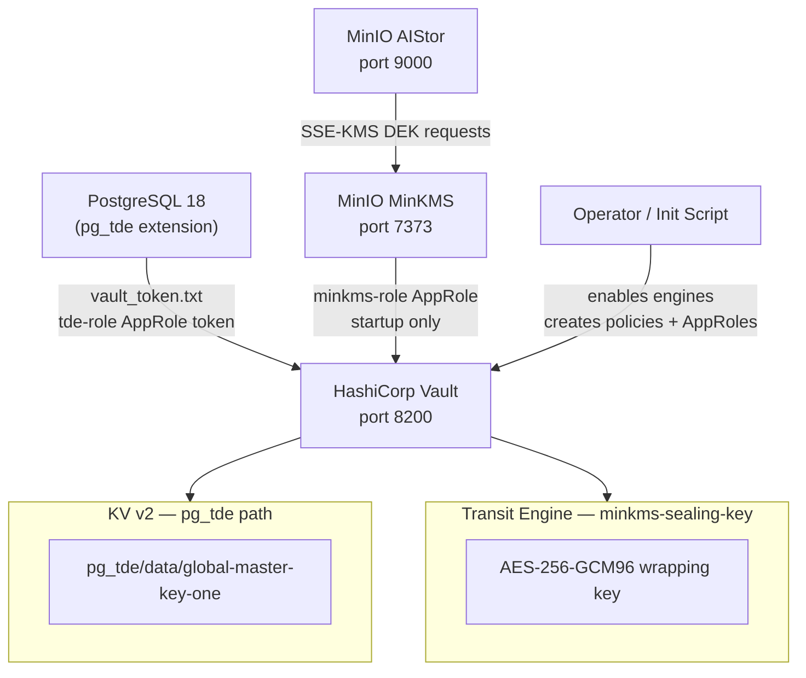

# HashiCorp Vault — Secrets Management

## Executive Summary

HashiCorp Vault is a purpose-built secrets management system that stores, generates, and controls access to sensitive data such as encryption keys, API tokens, and certificates. In this stack, Vault serves **two distinct roles**:

1. **KV v2 key provider for `pg_tde`** — stores the PostgreSQL master encryption key and issues tokens to each PostgreSQL node so pg_tde can fetch its key at startup.
2. **Transit seal backend for MinKMS** — wraps and unwraps the MinKMS root seal key using Vault's Transit secret engine and AppRole authentication. MinKMS cannot start unless Vault is running and unsealed.

Vault uses the **AppRole** authentication method for machine-to-machine authentication. Two separate AppRoles exist: `tde-role` (for PostgreSQL) and `minkms-role` (for MinKMS), each with the minimum required permissions.

## Why This Matters (Business / Compliance Context)

Storing encryption keys alongside the encrypted data is a fundamental security anti-pattern. If an attacker gains access to the PostgreSQL data directory, they should not be able to also find the key needed to decrypt it. Vault solves this by placing the key in a separate, independently secured system with its own access controls, audit logs, and key rotation capabilities. This is required by:

| Framework  | Control                                                      |
|------------|--------------------------------------------------------------|
| ISO 27001  | A.10.1.2 — Key management                                    |
| PCI-DSS    | Requirement 3.6 — Document key management procedures        |
| GDPR       | Article 32 — Encryption of personal data with managed keys  |
| SOC 2      | CC6.1 — Logical access encryption key management            |

## Component Role in This Stack



## Version & Distribution

| Property        | Value                                   |
|-----------------|-----------------------------------------|
| Version         | 1.21 (`hashicorp/vault:1.21`)           |
| Source          | HashiCorp Docker Hub                    |
| Install method  | Docker                                  |
| Architecture    | aarch64 / x86_64                        |
| Storage backend | File (`/vault/file`)                    |
| API address     | `http://vault:8200` (TLS disabled in R&D) |
| UI              | Enabled (`"ui": true`)                  |

## Configuration

### `vault/docker-compose.yml`

```yaml
services:
  vault:
    image: hashicorp/vault:1.21
    container_name: vault
    hostname: vault
    ports:
      - "8200:8200"
    cap_add:
      - IPC_LOCK      # prevents Vault from being swapped to disk (security)
    volumes:
      - vault_data:/vault/file    # persistent storage for Vault data
    environment:
      VAULT_ADDR: http://vault:8200
      VAULT_LOCAL_CONFIG: |
        {
          "storage": {
            "file": { "path": "/vault/file" }
          },
          "listener": [
            { "tcp": { "address": "vault:8200", "tls_disable": true } }
          ],
          "default_lease_ttl": "168h",    # 7 days
          "max_lease_ttl": "720h",        # 30 days
          "disable_mlock": false,
          "ui": true,
          "api_addr": "http://vault:8200"
        }
    command: server
```

### Part A — pg_tde Setup (`vault/custom/setup_postgres_tde.txt`)

Run inside the vault container after unsealing:

```bash
docker exec -it vault sh
export VAULT_TOKEN=<root_token>   # from vault/custom/vault-seal.json
export VAULT_SKIP_VERIFY=true

# 1. Enable KV v2 secret engine for pg_tde
vault secrets enable -path=pg_tde -version=2 kv

# 2. Create pg_tde access policy
vault policy write pg_tde-policy - <<EOF
path "pg_tde/data/*" {
  capabilities = ["read", "create", "update", "list"]
}
path "pg_tde/metadata/*" {
  capabilities = ["read", "list"]
}
path "sys/mounts/*" {
  capabilities = ["read"]
}
EOF

# 3. Enable AppRole auth (run once per Vault instance)
vault auth enable approle

# 4. Create AppRole for pg_tde
vault write auth/approle/role/tde-role policies="pg_tde-policy"

# 5. Generate a long-lived token for PostgreSQL nodes (paste into vault_token.txt on each node)
vault token create -policy="pg_tde-policy" -ttl=8760h -field=token
# Copy token → postgres/master/vault_token.txt + postgres/replica_one/vault_token.txt
```

### Part B — MinKMS Transit Setup (`vault/custom/setup_minkms_vault.txt`)

Continue inside the vault container:

```bash
# 1. Enable Transit secret engine
vault secrets enable transit

# 2. Create the MinKMS sealing key (AES-256-GCM96)
vault write -f transit/keys/minkms-sealing-key

# 3. Create MinKMS policy
vault policy write minkms-policy - <<EOF
path "transit/encrypt/minkms-sealing-key"  { capabilities = ["create", "update"] }
path "transit/decrypt/minkms-sealing-key"  { capabilities = ["create", "update"] }
path "transit/hmac/minkms-sealing-key"     { capabilities = ["create", "update"] }
path "transit/sign/minkms-sealing-key"     { capabilities = ["create", "update"] }
path "transit/verify/minkms-sealing-key"   { capabilities = ["create", "update"] }
path "transit/keys/minkms-sealing-key"     { capabilities = ["read", "create", "update"] }
EOF

# 4. Create AppRole for MinKMS
vault write auth/approle/role/minkms-role policies="minkms-policy"

# 5. Retrieve credentials → paste into minio/minkms/config.yaml
ROLE_ID=$(vault read -field=role_id auth/approle/role/minkms-role/role-id)
SECRET_ID=$(vault write -f -field=secret_id auth/approle/role/minkms-role/secret-id)
echo "Role ID:   $ROLE_ID"
echo "Secret ID: $SECRET_ID"
```

Paste the output into `minio/minkms/config.yaml`:

```yaml
hsm:
  hashicorp:
    vault:
      server: "http://vault:8200"
      approle:
        id: "<ROLE_ID>"
        secret: "<SECRET_ID>"
      transit:
        engine: "transit"
        key: "minkms-sealing-key"
```

### Key Parameters Explained

| Parameter              | Value Found            | Effect                                                                   | Recommendation                                            |
|------------------------|------------------------|--------------------------------------------------------------------------|-----------------------------------------------------------|
| Storage backend        | `file`                 | Stores Vault data on the local filesystem volume                         | Use Raft (integrated) or Consul for production HA         |
| `tls_disable`          | true                   | No TLS on Vault listener — all traffic is plaintext                      | **Enable TLS in production** with a proper certificate    |
| `default_lease_ttl`    | 168h (7 days)          | Service tokens expire after 7 days unless renewed                        | Reduce for higher security; implement token renewal       |
| `max_lease_ttl`        | 720h (30 days)         | Hard maximum for all leases                                               | Match your security policy                               |
| `disable_mlock`        | false                  | Vault locks memory pages to prevent sensitive data swapping              | Always false in production                                |
| KV path (pg_tde)       | `tde/` or `pg_tde/`   | Secret engine mount path used by pg_tde                                  | Be consistent; mount path in vault must match pg_tde config |
| Token file path        | `/etc/postgresql/secrets/vault_token.txt` (mode 600) | Token read by pg_tde for API authentication | Rotate before `default_lease_ttl` → set shorter TTL |

## Integration Points

| Component      | Integration                                                                                      |
|----------------|--------------------------------------------------------------------------------------------------|
| pg_tde         | Reads token from `vault_token.txt`; calls KV v2 (`pg_tde/data/global-master-key-one`) at startup  |
| **MinKMS**     | **Implemented** — AppRole `minkms-role` authenticates to Transit engine at startup only; root seal key never stored in plaintext |
| pgBackRest     | Same `vault_token.txt` token as pg_tde; authenticates to Vault for any secret reads              |
| Docker secrets | Token file mounted at `./vault_token.txt` → `/etc/postgresql/secrets/vault_token.txt` inside container |

## Known Issues & Research Findings

### TLS Disabled — Production Risk

The Vault server uses `tls_disable: true` for simplicity. All token material and key data flows over unencrypted HTTP within the Docker network. **Enable TLS in production** with a proper certificate.

### File Storage Backend — Not HA

The `file` storage backend does not support Vault HA. On every container restart, Vault is sealed and requires manual unseal (2 of 3 keys from `vault/custom/vault-seal.json`). For production, use Raft integrated storage with auto-unseal (AWS KMS, GCP KMS, or Azure Key Vault).

### MinKMS Hard Dependency on Vault at Startup

MinKMS calls Vault Transit at startup to unseal. If Vault is sealed or unreachable, MinKMS will refuse to start. Required startup order: **Vault (unsealed) → MinKMS → MinIO AIStor**. See `docs/operations/cluster-setup-order.md` for the full sequence.

### Token Expiry is Not Monitored

Vault tokens generated with `-ttl=8760h` (1 year) will expire silently. When the token expires, pg_tde will fail to fetch decryption keys on the next restart, potentially causing the entire cluster to fail to start. Implement token renewal via `vault token renew` in a cron job or use Vault Agent.

### MinKMS AppRole Secret ID Has No TTL

The `secret_id` in `minio/minkms/config.yaml` has no TTL or use limit by default. For production, set `secret_id_ttl` and `secret_id_num_uses` on the AppRole, and automate rotation via Vault Agent or a CI pipeline.

## Operational Notes

```bash
# Access Vault inside Docker
docker exec -it vault sh
export VAULT_TOKEN=<root_or_admin_token>
export VAULT_ADDR=http://vault:8200

# Check Vault status
vault status

# List enabled secret engines
vault secrets list

# List enabled auth methods
vault auth list

# Check token validity
vault token lookup <token>

# List keys in pg_tde KV store
vault kv list tde/

# View a specific key
vault kv get tde/global-master-key

# Renew a token (run before expiry)
vault token renew <token>

# Re-init Vault if container was restarted and token is lost
docker exec vault sh /vault/config/vault-init.sh
```

## Performance Considerations

- pg_tde does **not** call Vault on every query. The master key is fetched once at startup and cached in PostgreSQL shared memory. Vault latency only affects startup time and key rotation events.
- Vault's file backend has no inherent performance limit for this use case (< 1 request/minute expected from PostgreSQL). The bottleneck is always the etcd or PostgreSQL layer.
- For high-volume environments where many containers each call Vault at startup, use Vault Agent with response caching to reduce load on the Vault server.

## References & Further Reading

- [HashiCorp Vault Documentation](https://developer.hashicorp.com/vault/docs)
- [Vault KV v2 Secrets Engine](https://developer.hashicorp.com/vault/docs/secrets/kv/kv-v2)
- [Vault AppRole Auth Method](https://developer.hashicorp.com/vault/docs/auth/approle)
- [pg_tde Vault Integration](https://docs.percona.com/pg-tde/key-management/vault.html)
- [vault/custom/vault-init.sh](../../vault/custom/vault-init.sh)
