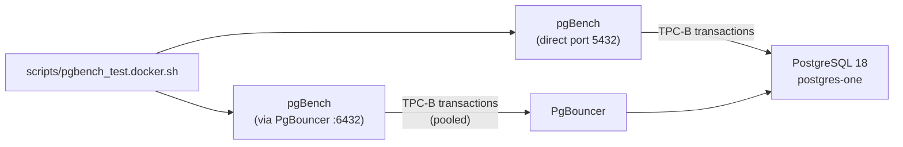

# pgBench — Performance Benchmarking

## Executive Summary

pgBench is PostgreSQL's built-in performance benchmarking tool. It simulates concurrent database clients running a standardised transaction workload (based on the TPC-B benchmark) and measures how many transactions per second (TPS) the database can handle, along with average and maximum latency. In this project, pgBench is used to compare the performance of direct PostgreSQL connections against connections through PgBouncer, and to quantify the overhead that TDE encryption (`tde_heap`) adds to normal database I/O.

The benchmark results guide configuration decisions — for example, whether the default PgBouncer pool size is adequate, and whether the TDE overhead is within acceptable bounds for the target workload.

## Why This Matters (Business / Compliance Context)

Before committing to an encrypted, high-availability database architecture in production, it is essential to quantify the performance cost. TDE encryption is not free — every read and write involves cryptographic operations. pgBench results provide the evidence needed to answer questions from management such as: "How many concurrent users can this database support?" and "What is the performance penalty for encrypting all data?" These results directly inform capacity planning and SLA commitments.

## Component Role in This Stack



## Version & Distribution

| Property        | Value                                                           |
|-----------------|-----------------------------------------------------------------|
| Version         | Built-in with PostgreSQL 18.1 (same image)                     |
| Source          | Percona Distribution for PostgreSQL 18 (included)              |
| Architecture    | aarch64 / x86_64                                               |

## Test Scenarios

### Default Script Configuration (`scripts/pgbench_test.docker.sh`)

| Parameter        | Default Value   | Notes                                   |
|------------------|-----------------|-----------------------------------------|
| Scale factor     | 50              | ~7.5 MB database                        |
| Clients          | 50              | Concurrent connections                  |
| Threads          | 10              | pgBench worker threads                  |
| Duration         | 60 seconds      | Test run length                         |
| Mode             | Simple query    | Standard TPC-B                          |
| Report interval  | every 5 seconds (`-P 5`) | Intermediate progress report |

### Scenario 1 — Direct PostgreSQL Connection

```bash
# Test parameters from pgbench_test.docker.sh
SCALE=50 CLIENTS=50 THREADS=10 DURATION=60

# Initialise the test database (scale factor 50)
docker exec postgres-one bash -c "
  PGPASSWORD='$PGPASSWORD' pgbench -h localhost -p 5432 -U postgres -i -s 50 pgbench_test"

# Run the benchmark
docker exec postgres-one bash -c "
  PGPASSWORD='$PGPASSWORD' pgbench -h localhost -p 5432 -U postgres \
    -c 50 -j 10 -T 60 -C -P 5 pgbench_test"
```

| Parameter        | Value (TO BE CONFIRMED)           |
|------------------|-----------------------------------|
| Scale factor     | 50 (~7.5 MB)                      |
| Clients          | 50                                |
| Threads          | 10                                |
| Duration         | 60 s                              |
| Transactions/sec | [TO BE CONFIRMED: run test and record] |
| Latency avg      | [TO BE CONFIRMED: run test and record] |
| Latency stddev   | [TO BE CONFIRMED: run test and record] |

### Scenario 2 — PgBouncer Connection (Transaction Pool Mode)

```bash
# Same parameters, port 6432 (PgBouncer)
docker exec postgres-one bash -c "
  PGPASSWORD='$PGPASSWORD' pgbench -h localhost -p 6432 -U postgres \
    -c 50 -j 10 -T 60 -C -P 5 pgbench_test"
```

| Parameter        | Value (TO BE CONFIRMED)           |
|------------------|-----------------------------------|
| Scale factor     | 50                                |
| Clients          | 50                                |
| Threads          | 10                                |
| Duration         | 60 s                              |
| Transactions/sec | [TO BE CONFIRMED: expected similar to Scenario 1] |
| Latency avg      | [TO BE CONFIRMED: slight overhead from pooling]   |
| Pool Statistics  | Check `SHOW POOLS` in pgbouncer DB                |

### Scenario 3 — Light Test (Connection Pooling Benefit)

```bash
# Many clients — direct PG would fail at 200 clients if max_connections=100
./scripts/pgbench_test.docker.sh 50 200 20 60
```

### Scenario 4 — High Throughput Test

```bash
# Large scale, longer duration
./scripts/pgbench_test.docker.sh 100 100 20 120
```

### Scenario 5 — Sustained Load

```bash
./scripts/pgbench_test.docker.sh 50 50 10 300
```

### Scenario 6 — Burst Traffic

```bash
# Many clients, short burst
./scripts/pgbench_test.docker.sh 50 500 50 30
```

### Scenario 7 — Read-Only Workload

```bash
# -S flag: SELECT-only queries (no writes)
docker exec postgres-one bash -c "
  PGPASSWORD='$PGPASSWORD' pgbench -h localhost -p 6432 -U postgres \
    -c 50 -j 10 -T 60 -S pgbench_test"
```

## Results Analysis

> **Note**: Benchmark results are not yet recorded in this repository. The R&D benchmark work is planned in Research Cycle 4: Task RC4-04. The tables above have placeholders marked [TO BE CONFIRMED]. Run the benchmark script and fill in the actual TPS and latency numbers.

### Expected Results Summary (from `STRESS_TEST_GUIDE.md`)

```
transaction type: <builtin: TPC-B (sort of)>
scaling factor: 50
query mode: simple
number of clients: 50
number of threads: 10
duration: 60 s
number of transactions actually processed: XXXXXX
latency average = XX.XXX ms
latency stddev  = XX.XXX ms
tps = XXXX.XX (including connections establishing)
tps = XXXX.XX (excluding connections establishing)
```

### Key Metrics to Interpret

| Metric           | Meaning                                         | Goal                                |
|------------------|-------------------------------------------------|-------------------------------------|
| TPS              | Transactions per second — higher is better       | > baseline without TDE              |
| Latency average  | Average transaction time — lower is better       | < 30ms for 50 clients               |
| Latency stddev   | Consistency of response times                   | < 20% of latency average            |
| `cl_waiting`     | PgBouncer clients waiting for pool slot          | Must be 0; increase pool if > 0     |

### PgBouncer Pool Statistics  

```sql
-- Run inside PgBouncer admin console after benchmark
SHOW POOLS;
/*
database     | user     | cl_active | cl_waiting | sv_active | sv_idle
-------------|----------|-----------|------------|-----------|--------
pgbench_test | postgres |        50 |          0 |        25 |      0
*/
```

- `cl_waiting = 0` → pool is not a bottleneck.
- `sv_active ≈ default_pool_size / 2` → normal for transaction mode.

## Observations & Recommendations

### TDE Encryption Overhead

TDE (`tde_heap`) encryption adds per-page AES operations on every read and write. Based on prior PostgreSQL TDE research, a 5–15% TPS reduction is typical for write-heavy workloads. However, for read-heavy workloads with a warm shared_buffers cache, the overhead may be negligible.

[TO BE CONFIRMED: run parallel tests — one with `default_table_access_method = heap` and one with `tde_heap` — and record the TPS delta.]

### PgBouncer Pooling Benefit

With `max_connections = 100`, a direct PostgreSQL connection test with 200 clients would fail. PgBouncer's `max_client_conn = 500` allows 200+ clients to connect successfully, with pgBouncer multiplexing them into the 75-connection pool. The latency overhead of transaction-mode pooling is typically < 1ms.

### Recommended Tuning Actions

1. If `cl_waiting > 0`: increase `default_pool_size` in `pgbouncer.ini` and reload.
2. If latency is high: check CPU saturation and disk I/O on the Docker host.
3. If TPS is significantly lower with TDE: review `shared_buffers` sizing to ensure hot data stays in cache (avoiding repeated decryption of the same pages).

## References & Further Reading

- [pgBench Documentation](https://www.postgresql.org/docs/current/pgbench.html)
- [TPC-B Benchmark](https://www.tpc.org/tpcb/)
- [STRESS_TEST_GUIDE.md](../../STRESS_TEST_GUIDE.md)
- [scripts/pgbench_test.docker.sh](../../scripts/pgbench_test.docker.sh)
- [docs/benchmarks/pgbench-results.md](../benchmarks/pgbench-results.md)
