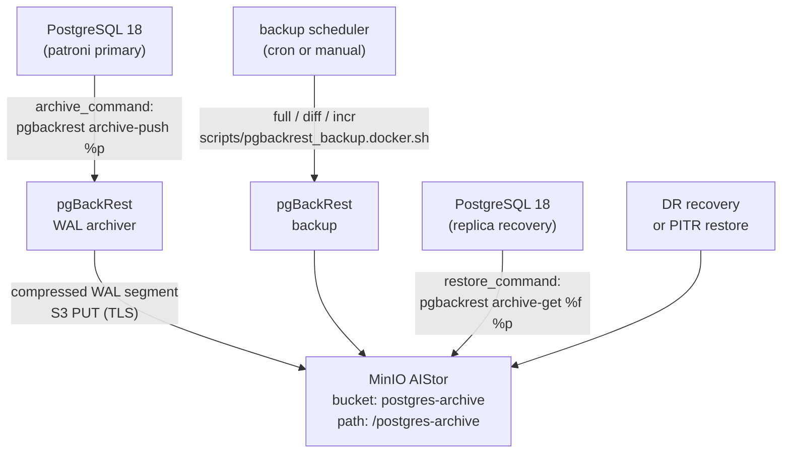

# pgBackRest — Backup and PITR

## Executive Summary

pgBackRest is a robust PostgreSQL backup and recovery tool that seamlessly handles full, differential, and incremental backups, WAL archiving, and Point-In-Time Recovery (PITR). While PostgreSQL writes data changes to Write-Ahead Log (WAL) files, pgBackRest continuously archives these WAL files to MinIO object storage, and periodically takes full and incremental base backups. Together, WAL archiving and base backups allow the database to be restored to any point in time — down to a specific second — even after catastrophic failures.

In this stack, pgBackRest is integrated with the Patroni-managed cluster (`stanza: postgres-patroni-tde`) and stores all backups in MinIO's `postgres-archive` S3 bucket over a TLS-secured connection. Backups are compressed with lz4 for speed.

## Why This Matters (Business / Compliance Context)

Backups are the last line of defence against data loss — from hardware failures, accidental deletions, ransomware, or software bugs. PITR capability in particular is essential for:

| Framework  | Control                                                          |
|------------|------------------------------------------------------------------|
| ISO 27001  | A.12.3 — Information backup; A.17.1 — Business continuity       |
| GDPR       | Article 32 — Ability to restore personal data in a timely manner |
| SOC 2      | Availability — Recovery Time Objective (RTO) / Recovery Point Objective (RPO) |
| PCI-DSS    | Requirement 9.4 — Protect backups from unauthorised access       |

## Component Role in This Stack



## Version & Distribution

| Property        | Value                                                             |
|-----------------|-------------------------------------------------------------------|
| Version         | percona-pgbackrest (aarch64) / pgbackrest (Ubuntu arm64)          |
| Source          | Percona DNF repository / PGDG apt                                 |
| Install method  | Docker — installed in Dockerfile alongside PostgreSQL             |
| Architecture    | aarch64 / x86_64                                                  |
| Config file     | `/etc/pgbackrest/pgbackrest.conf`                                 |
| Stanza name     | `postgres-patroni-tde`                                             |

## Configuration

### `postgres/master/pgbackrest/pgbackrest.conf`

```ini
[global]
# Repository: MinIO AIStor (S3-compatible, path-style)
repo1-type           = s3
repo1-s3-bucket      = postgres-archive          # bucket name in MinIO
repo1-s3-endpoint    = https://minio:9000         # MinIO S3 API endpoint
repo1-s3-uri-style   = path                       # required for non-AWS S3
repo1-s3-region      = us-east-1                  # region label (any value for MinIO)
repo1-s3-key         = pgbackrest                 # MinIO access key
repo1-s3-key-secret  = test-deni-123              # MinIO secret key (R&D only)
repo1-storage-verify-tls = n                     # WORKAROUND: disable TLS verify (self-signed cert)
repo1-storage-ca-file = /etc/postgres/certs/ca.crt  # CA for TLS verification

# Path prefix inside the bucket
repo1-path           = /postgres-archive

# Logging
log-level-console    = info
log-level-file       = info

# Compression: lz4 (fastest compression, good for WAL)
compress-type        = lz4

[postgres-patroni-tde]               # stanza name must match archive_command
pg1-path             = /data/db       # PostgreSQL data directory
```

### Patroni / PostgreSQL archive settings (`patroni-one.yml`)

```yaml
parameters:
  archive_mode: "on"
  archive_command: "pgbackrest --stanza=postgres-patroni-tde archive-push %p"

recovery_conf:
  restore_command: 'pgbackrest --stanza=postgres-patroni-tde archive-get %f "%p"'
```

### Stanza Initialisation (`scripts/pgbackrest_setup_stanza.docker.sh`)

```bash
#!/bin/bash
STANZA_NAME="postgres-patroni-tde"

# Find the current Patroni leader
LEADER=$(curl -s http://localhost:8008/cluster | jq -r '.members[] | select(.role=="leader") | .name')

# Create the stanza on the leader
docker exec -t $LEADER pgbackrest --stanza=$STANZA_NAME stanza-create

# Verify the stanza is configured correctly
docker exec -t $LEADER pgbackrest --stanza=$STANZA_NAME check
```

### Backup Execution (`scripts/pgbackrest_backup.docker.sh`)

```bash
#!/bin/bash
STANZA="postgres-patroni-tde"
BACKUP_TYPE="${1:-full}"    # full | diff | incr

# Find current leader, then run backup on it
LEADER=$(curl -s http://localhost:8008/cluster | jq -r '.members[] | select(.role=="leader") | .name')

docker exec -t $LEADER \
  pgbackrest --stanza="${STANZA}" \
             --type="${BACKUP_TYPE}" \
             backup

# Show backup inventory
docker exec -t $LEADER pgbackrest --stanza="${STANZA}" info
```

### Backup Scheduling (`BACKUP_SCHEDULING.md`)

```cron
# Recommended balanced schedule (add to crontab on host)
# Full backup every Sunday at 2 AM
0 2 * * 0 cd /project && ./scripts/pgbackrest-backup.sh full >> /var/log/pgbackrest-backup.log 2>&1

# Differential backup daily (Mon–Sat) at 2 AM
0 2 * * 1-6 cd /project && ./scripts/pgbackrest-backup.sh diff >> /var/log/pgbackrest-backup.log 2>&1

# Incremental backup every 6 hours
0 */6 * * * cd /project && ./scripts/pgbackrest-backup.sh incr >> /var/log/pgbackrest-backup.log 2>&1
```

### Key Parameters Explained

| Parameter               | Value Found        | Effect                                                                  | Recommendation                                          |
|-------------------------|--------------------|-------------------------------------------------------------------------|---------------------------------------------------------|
| `repo1-type`            | s3                 | Uses S3-compatible API (MinIO)                                          | No change needed                                        |
| `repo1-s3-bucket`       | postgres-archive   | Bucket where all backups and WAL are stored                             | Use separate buckets per environment (dev/prod)         |
| `repo1-s3-uri-style`    | path               | Path-style S3 URLs — required for MinIO                                 | Required; do not change to `host`                       |
| `repo1-storage-verify-tls` | n              | TLS certificate not verified — R&D workaround for self-signed cert      | **Set to `y`** and use `repo1-storage-ca-file` in prod |
| `compress-type`         | lz4                | lz4 compression — fastest; smaller WAL → faster archiving               | Use `zstd` if CPU budget allows; better ratio at similar speed |
| `repo1-s3-key-secret`   | test-deni-123      | MinIO secret key — plaintext in config file                             | Use Vault or environment variable injection in prod     |
| Stanza name             | postgres-patroni-tde | Must match `archive_command` in PostgreSQL config                     | Keep consistent across all nodes                        |

## Integration Points

| Component      | Integration                                                                                  |
|----------------|----------------------------------------------------------------------------------------------|
| PostgreSQL     | `archive_command` triggers pgBackRest on every WAL segment fill (every ~16 MB of writes)    |
| Patroni        | `restore_command` in `recovery_conf` tells replicas to use pgBackRest for WAL fetch          |
| MinIO AIStor   | pgBackRest stores all backups and WAL in bucket `postgres-archive` via S3 API                |
| pg_tde         | Base backup files contain encrypted heap pages; pgBackRest does not decrypt them (opaque bytes) |
| pg_cron        | [TO BE CONFIRMED: no pg_cron backup scheduling found; external cron recommended]              |

## Known Issues & Research Findings

### `repo1-storage-verify-tls=n` — Must Be Fixed Before Production

pgBackRest does not verify MinIO's TLS certificate because it is self-signed. In production:
1. Remove `repo1-storage-verify-tls=n`
2. Keep `repo1-storage-ca-file=/etc/postgres/certs/ca.crt` pointing to the Root CA

### Stanza Must Be Created Before First Backup

The stanza creation step (`pgbackrest stanza-create`) must be run **after** the cluster bootstraps and WAL archiving is active, but **before** the first archive-push. If WAL segments are pushed before the stanza exists, pgBackRest will log errors and archive_command will return non-zero, which puts PostgreSQL into archive failure mode.

Run in this order:
1. Start PostgreSQL cluster via Patroni
2. Run `pgbackrest_setup_stanza.docker.sh`
3. Run `pgbackrest_backup.docker.sh full` for the first full backup
4. Enable the cron schedule

### pgBackRest Backups and TDE Encryption

pgBackRest backups contain the encrypted heap files (pg_tde encrypts at the page level). This means:
- Backups are secure: even a stolen backup file cannot be decrypted without the Vault master key.
- Restoration requires the same Vault instance (or a restored Vault snapshot) with the same master key available.
- Key rotation **before** a backup means that backup can only be restored if the new key is available in Vault.

## Operational Notes

```bash
# Check stanza / backup status
docker exec postgres-one pgbackrest --stanza=postgres-patroni-tde info

# Run a manual full backup
./scripts/pgbackrest_backup.docker.sh full

# Run a differential backup
./scripts/pgbackrest_backup.docker.sh diff

# Run an incremental backup
./scripts/pgbackrest_backup.docker.sh incr

# Verify the archive connection
docker exec postgres-one pgbackrest --stanza=postgres-patroni-tde check

# List available backup targets for PITR
docker exec postgres-one pgbackrest --stanza=postgres-patroni-tde info --output=json | jq '.[] | .backup[] | {label, type, timestamp}'

# Restore to a specific point in time (run on a recovery server)
pgbackrest --stanza=postgres-patroni-tde restore \
  --type=time \
  "--target=2026-03-20 14:00:00+07" \
  --target-action=promote
```

## Performance Considerations

- **lz4 compression** is the optimal choice for WAL archiving: it is the fastest compressor available in pgBackRest and significantly reduces MinIO storage costs and network bandwidth compared to uncompressed WAL.
- **Full backup I/O**: A full pgBackRest backup reads the entire data directory (`/data/db`). On a loaded primary, this can impact I/O. Consider running full backups from a replica if possible.
- **WAL archiving latency**: pgBackRest's `archive-push` must complete within PostgreSQL's `archive_timeout` (default: no timeout). On slow networks, increase `--process-max` in pgBackRest or increase shared WAL buffers.
- The lz4-compressed backup of a 50-scale pgBench database (≈ 770 MB) compresses to approximately 150–200 MB depending on entropy. TDE-encrypted data has near-random entropy, so compression ratios will be lower than for plain-text data.

## References & Further Reading

- [pgBackRest User Guide](https://pgbackrest.org/user-guide.html)
- [pgBackRest Configuration Reference](https://pgbackrest.org/configuration.html)
- [BACKUP_SCHEDULING.md](../../BACKUP_SCHEDULING.md)
- [scripts/pgbackrest_backup.docker.sh](../../scripts/pgbackrest_backup.docker.sh)
- [scripts/pgbackrest_setup_stanza.docker.sh](../../scripts/pgbackrest_setup_stanza.docker.sh)
- [MinIO S3-compatible pgBackRest](https://pgbackrest.org/user-guide.html#s3-compatible)
