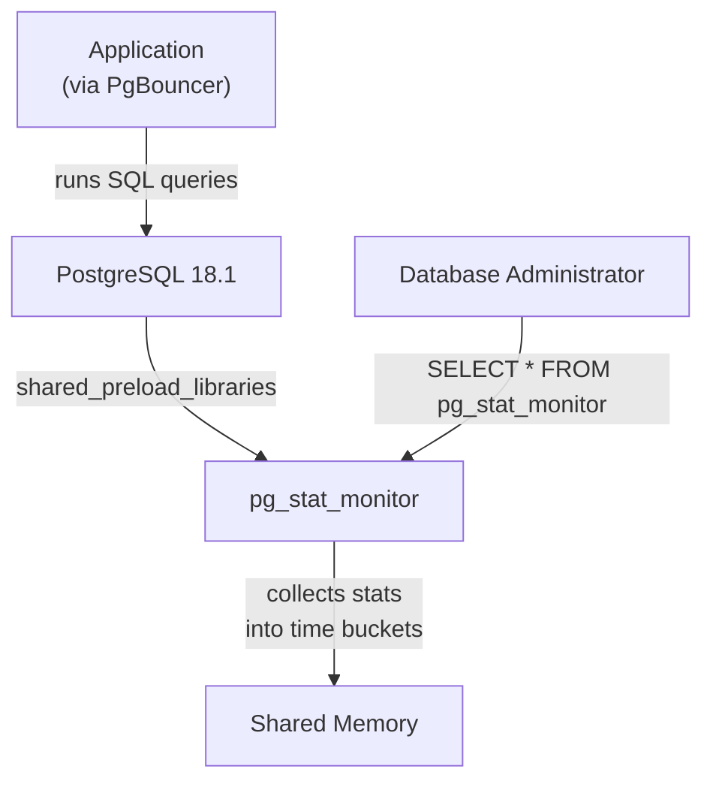

# pg_stat_monitor — Query Analytics

## Executive Summary

`pg_stat_monitor` is an advanced query performance monitoring tool developed by Percona. It is a drop-in replacement (and significant upgrade) for the standard `pg_stat_statements` extension. Instead of just showing lifetime aggregate query statistics, it groups queries into time buckets, tracks actual parameter values (if configured), records query execution plans, and provides deeper insight into CPU, I/O, and wait events per query.

In this infrastructure, `pg_stat_monitor` is loaded into memory at startup and provides the observability required to identify poorly performing queries — especially those affected by TDE encryption overhead (`tde_heap`) or partitioned table routing via `pg_partman`.

## Why This Matters (Business / Compliance Context)

Without detailed query analytics, diagnosing performance degradation is largely guesswork. `pg_stat_monitor` provides the empirical data needed to:
- **Identify bottlenecks**: Find exactly which queries consume the most disk I/O or CPU time.
- **Measure TDE impact**: Compare query execution times on plain tables vs encrypted tables.
- **Optimise infrastructure**: Justify scaling up resources (CPU/RAM) based on hard metrics rather than anecdotal slowness. 

This directly supports SLA management and ensures the system handles production workloads efficiently.

## Component Role in This Stack



## Version & Distribution

| Property        | Value                                                              |
|-----------------|--------------------------------------------------------------------|
| Version         | Bundled with Percona Distribution for PostgreSQL 18.1              |
| Source          | Percona base image                                                 |
| Install method  | Docker — included in base image; activated via `CREATE EXTENSION`    |
| Architecture    | aarch64 / x86_64                                                   |

## Configuration

### Shared preload (from `patroni-one.yml`)

```yaml
parameters:
  shared_preload_libraries: "pg_tde, pg_partman_bgw, pg_stat_monitor, pg_cron, pgaudit"
# pg_stat_monitor must be loaded at server startup to track statistics
```

### Extension Installation (`postgres_setup.docker.sh`)

```sql
-- Installed in the 'postgres' database by default
CREATE EXTENSION IF NOT EXISTS pg_stat_monitor;
```

### Configuration Options (Runtime Defaults)

While not explicitly configured in `patroni-one.yml`, `pg_stat_monitor` uses these important defaults that can be adjusted dynamically via `ALTER SYSTEM` or Patroni configuration:

| Parameter                             | Default Value | Description                                                                 |
|---------------------------------------|---------------|-----------------------------------------------------------------------------|
| `pg_stat_monitor.pgsm_max`            | 100         | Maximum number of statements tracked                                       |
| `pg_stat_monitor.pgsm_bucket_time`    | 60          | Time in seconds for each aggregation bucket                               |
| `pg_stat_monitor.pgsm_track_utility`  | on          | Track utility commands (e.g., CREATE TABLE, DROP)                         |
| `pg_stat_monitor.pgsm_track_planning` | off         | Track query planning time and statistics (enable for deep tuning)         |
| `pg_stat_monitor.pgsm_normalized_query`| on        | Replace literal values with $1, $2 for aggregation                        |

## Integration Points

| Component     | Integration                                                                                   |
|---------------|-----------------------------------------------------------------------------------------------|
| PostgreSQL    | Hooks into the core query executor and planner to measure time and resource usage             |
| pg_tde        | Can be used to measure the exact I/O (`blk_read_time`, `blk_write_time`) overhead of TDE encryption |
| pgBench       | Captures pgBench transaction performance metrics internally during stress tests               |

## Known Issues & Research Findings

### pg_stat_statements Compatibility

`pg_stat_monitor` provides a `pg_stat_statements` compatibility view. Tools expecting standard `pg_stat_statements` (such as Datadog, PMM, or custom monitoring scripts) will continue to work without modification, but they will not expose the advanced features like histograms or time buckets.

### Overhead

Because `pg_stat_monitor` tracks more detailed metrics than `pg_stat_statements` (including query text, bucket ranges, and client IP), it consumes slightly more CPU and shared memory. During R&D, this overhead was considered negligible compared to the value of the metrics provided, but it should be monitored if `pgsm_max` is significantly increased.

## Operational Notes

```bash
# View the top 5 longest-running queries in the current bucket
docker exec postgres-one psql -U postgres -c "
SELECT query, calls, total_exec_time, mean_exec_time 
FROM pg_stat_monitor 
ORDER BY total_exec_time DESC LIMIT 5;"

# Reset statistics (clears all buckets)
docker exec postgres-one psql -U postgres -c "SELECT pg_stat_monitor_reset();"

# Check the current bucket timing
docker exec postgres-one psql -U postgres -c "
SELECT bucket, bucket_start_time, query, calls 
FROM pg_stat_monitor 
ORDER BY bucket_start_time DESC LIMIT 10;"

# View query performance histograms (execution times)
docker exec postgres-one psql -U postgres -c "
SELECT query, resp_calls 
FROM pg_stat_monitor 
WHERE array_length(resp_calls, 1) > 0;"
```

## Performance Considerations

- **Bucket Time**: The default `pgsm_bucket_time` is 60 seconds. This means statistics roll over every minute. If you need to keep statistics longer, increase `pgsm_bucket_time` or ingest the data into an external monitoring system like Percona Monitoring and Management (PMM).
- **Planning Time**: Enabling `pgsm_track_planning` adds overhead to every query parse. Keep it off in production unless actively diagnosing a planner issue.

## References & Further Reading

- [pg_stat_monitor Documentation](https://docs.percona.com/pg-stat-monitor/index.html)
- [Percona Monitoring and Management (PMM)](https://www.percona.com/software/database-tools/percona-monitoring-and-management)
