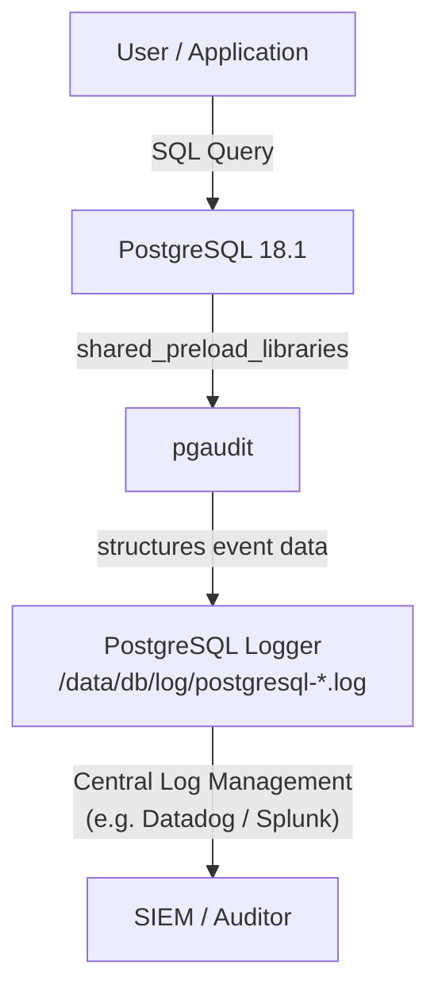

# pgAudit — Audit Logging

## Executive Summary

`pgAudit` (PostgreSQL Audit Extension) provides detailed session and object audit logging via the standard PostgreSQL logging facility. While standard PostgreSQL `log_statement = 'all'` can log every query, it lacks the structure and granular filtering needed for compliance. pgAudit solves this by logging an exact, structured record of the statements that were executed and the objects they accessed, even if the statements were buried inside a stored procedure or function.

In this infrastructure, pgAudit is loaded at startup to capture administrative and data-access operations, ensuring a verifiable trail of who did what, and when, for security and compliance audits.

## Why This Matters (Business / Compliance Context)

Audit logging is a mandatory requirement for almost all regulatory standards. Without structured audit trails, you cannot prove to an auditor that a database administrator did *not* access sensitive PII or that an application service account only wrote to allowed tables.

| Framework  | Relevant Control                                                   |
|------------|--------------------------------------------------------------------|
| ISO 27001  | A.12.4.1/2/3 — Event logging, protection, administrator activity  |
| SOC 2      | CC7.2 — Security event logging, CC6.8 — Unauthorised access      |
| HIPAA      | 164.312(b) — Audit controls                                        |
| GDPR       | Article 28 / Recital 39 — Verifiable processing activities         |
| PCI-DSS    | Requirement 10 — Track and monitor all access to network / data    |

## Component Role in This Stack



## Version & Distribution

| Property        | Value                                                           |
|-----------------|-----------------------------------------------------------------|
| Version         | Bundled with Percona Distribution for PostgreSQL 18.1           |
| Source          | Percona base image                                              |
| Install method  | Docker — included in base image; activated via `CREATE EXTENSION` |
| Architecture    | aarch64 / x86_64                                                |

## Configuration

### Shared preload (from `patroni-one.yml`)

```yaml
parameters:
  shared_preload_libraries: "pg_tde, pg_partman_bgw, pg_stat_monitor, pg_cron, pgaudit"
# pgAudit must be loaded at server startup to capture events
```

### Extension Installation (`postgres_setup.docker.sh`)

```sql
-- Installed in the 'postgres' database by default
CREATE EXTENSION IF NOT EXISTS pgaudit;
```

### Configuration Options

pgAudit is explicitly configured in the Patroni configuration (`patroni-one.yml` / `patroni-two.yml`) within the PostgreSQL parameters section. The current settings applied to the cluster are:

| Parameter               | Set Value | Description                                                                                                   |
|-------------------------|-----------|---------------------------------------------------------------------------------------------------------------|
| `pgaudit.log`           | `'all'`   | Logs absolutely every category of statement (`read`, `write`, `function`, `role`, `ddl`, `misc`).             |
| `pgaudit.log_catalog`   | `off`     | Prevents pgAudit from logging queries to system catalogs (like `pg_class`), significantly reducing log noise. |
| `pgaudit.log_client`    | `off`     | Specifies whether log messages will be visible to a client process such as psql. `off` means they only go to the server log. |
| `pgaudit.log_level`     | `'log'`   | The log level to use for log entries (e.g., `log`, `info`, `notice`, `warning`).                              |

## pgaudit.log Values
 
| Value | Yang di-log |
|---|---|
| `read` | `SELECT`, `COPY` saat data dibaca dari tabel/sequence |
| `write` | `INSERT`, `UPDATE`, `DELETE`, `TRUNCATE`, `COPY` saat data ditulis |
| `function` | Pemanggilan function dan `DO` blocks |
| `role` | `GRANT`, `REVOKE`, `CREATE/ALTER/DROP ROLE` |
| `ddl` | Semua DDL kecuali yang masuk kategori `role` — `CREATE`, `ALTER`, `DROP` untuk object seperti table, index, dll |
| `misc` | Perintah lain-lain seperti `DISCARD`, `FETCH`, `CHECKPOINT`, `VACUUM`, `SET` |
| `misc_set` | Khusus perintah `SET` saja (subset dari `misc`) |
| `all` | Semua kategori di atas |

## Integration Points

| Component     | Integration                                                                                   |
|---------------|-----------------------------------------------------------------------------------------------|
| PostgreSQL    | Writes audit records securely to PostgreSQL's native logger, appearing in `log_directory`     |
| SIEM (Future) | Audit logs are typically scraped from disk by an agent (e.g. FluentBit) and shipped centrally |
| pgBouncer     | Audit logs will record the pgBouncer IP (`127.0.0.1`), not the terminal client's IP, unless `application_name` is passed |

## Known Issues & Research Findings

### pgAudit Requires Specific Configuration

Simply adding `pgaudit` to `shared_preload_libraries` makes it available, but it **does not log anything until configured**. This is correctly handled in our environment.

**Current Implementation**: The Patroni configuration explicitly injects `pgaudit.log = 'all'` along with catalog filters (`pgaudit.log_catalog: off`) and routing options (`pgaudit.log_client: off`). This successfully tracks all data modifications and schema changes.

### Log Volume

If `pgaudit.log = 'all'` or `'read'` is used, every single `SELECT` query will generate an audit log entry. This will dramatically increase the size of `/data/db/log/`, potentially filling the volume and impacting disk I/O. Be selective about what you audit.

### Prepared Statements

By default, pgAudit does not log parameter values for prepared statements. If your compliance requires knowing *what* data was inserted (not just *that* an insert occurred), you must set `pgaudit.log_parameter = on`. Note that doing so might inadvertently log sensitive PII (which would otherwise be encrypted by `pg_tde`) into the plaintext log files. **Use with caution.**

## Operational Notes

```bash
# Check if the extension is installed
docker exec postgres-one psql -U postgres -c "SELECT extname, extversion FROM pg_extension WHERE extname = 'pgaudit';"

# Dynamically change what gets audited (session level)
docker exec postgres-one psql -U postgres -c "SET pgaudit.log = 'write, ddl';"

# Dynamically change what gets audited (system level - requires reload)
docker exec postgres-one psql -U postgres -c "ALTER SYSTEM SET pgaudit.log = 'write, ddl'; SELECT pg_reload_conf();"

# Change via patronictl rest api if you use patroni
curl -s -XPATCH -H "Content-Type: application/json" -d '{
  "postgresql": {
    "parameters": {
      "pgaudit.log": "write, ddl",
      "pgaudit.log_catalog": "off",
      "pgaudit.log_client": "off",
      "pgaudit.log_level": "log"
    }
  }
}' http://localhost:8008/config

curl -s XPOST http://localhost:8008/reload

# View the log entries
docker exec postgres-one tail -f /data/db/log/postgresql-*.log | grep AUDIT
```

## Performance Considerations

- **Production Configuration (`pgaudit.log`):** It is highly recommended **not** to use `pgaudit.log = 'all'` in production. Setting this value logs every single `SELECT` query (`read`), which will generate a massive volume of logs, degrade database performance, and consume storage rapidly. Instead, use `'write, ddl'` to only track data modifications and schema changes, or use role-based auditing (`pgaudit.role`) to strictly log the activity of specific sensitive accounts.
- **Disk I/O**: Every audited statement adds physical write I/O to the logging disk. For a high-transaction system, this can become a bottleneck. Ensure the log volume is on fast storage.
- **CPU**: The executor hook used by pgAudit adds negligible CPU overhead to query execution. The performance impact entirely comes from writing the log lines.
- **Log Rotation**: If extensive auditing is enabled, ensure `log_rotation_age` and `log_rotation_size` in Patroni are strictly configured to prevent the log directory from consuming all local disk space.

## References & Further Reading

- [pgAudit GitHub / Documentation](https://github.com/pgaudit/pgaudit)
- [Percona Distribution (pgAudit)](https://docs.percona.com/postgresql/16/extensions/pgaudit.html)
- [PostgreSQL Error Reporting and Logging](https://www.postgresql.org/docs/current/runtime-config-logging.html)
