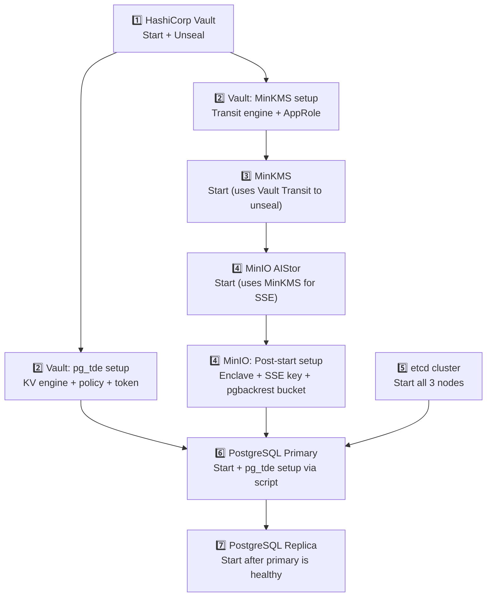

# Cluster Setup Order — Full Stack Bootstrap

This guide describes the **exact order** to bring up the entire stack from scratch. Services have hard dependencies on each other; starting them out of order will cause startup failures.

## Startup Order Overview



> **Rule of thumb:** Vault must be running and unsealed before **anything else** starts. etcd must be healthy before Patroni (inside PostgreSQL containers) will elect a leader.

---

## Step 1 — HashiCorp Vault

```bash
# Start Vault
make up-vault

# Vault starts sealed. Unseal it using 2 of the 3 keys from vault/custom/vault-seal.json
docker exec vault vault operator unseal <key_1>
docker exec vault vault operator unseal <key_2>

# Verify unsealed
docker exec vault sh -c 'VAULT_TOKEN=<root_token> vault status' | grep Sealed
# Expected: Sealed  false
```

### Step 1a — Setup Vault for pg_tde (PostgreSQL encryption)

Run inside the `vault` container (see `vault/custom/setup_postgres_tde.txt` for reference):

```bash
docker exec -it vault sh
export VAULT_TOKEN=<root_token>   # from vault/custom/vault-seal.json → root_token
export VAULT_SKIP_VERIFY=true

# 1. Enable KV v2 secret engine for pg_tde
vault secrets enable -path=pg_tde -version=2 kv

# 2. Create pg_tde policy
vault policy write pg_tde-policy - <<EOF
path "pg_tde/data/*" {
  capabilities = ["read", "create", "update", "list"]
}
path "pg_tde/metadata/*" {
  capabilities = ["read", "list"]
}
path "sys/mounts/*" {
  capabilities = ["read"]
}
EOF

# 3. Enable AppRole auth (if not already enabled)
vault auth enable approle

# 4. Create AppRole for pg_tde
vault write auth/approle/role/tde-role policies="pg_tde-policy"

# 5. Generate a long-lived token for PostgreSQL nodes (paste into vault_token.txt)
vault token create -policy="pg_tde-policy" -ttl=8760h -field=token
# Copy the token output → paste into:
#   postgres/master/vault_token.txt
#   postgres/replica_one/vault_token.txt
```

### Step 1b — Setup Vault for MinKMS (Transit seal wrapping)

Continue inside the vault container (see `vault/custom/setup_minkms_vault.txt` for reference):

```bash
# 1. Enable Transit secret engine
vault secrets enable transit

# 2. Create the sealing key for MinKMS
vault write -f transit/keys/minkms-sealing-key

# 3. Create MinKMS policy
vault policy write minkms-policy - <<EOF
path "transit/encrypt/minkms-sealing-key"  { capabilities = ["create", "update"] }
path "transit/decrypt/minkms-sealing-key"  { capabilities = ["create", "update"] }
path "transit/hmac/minkms-sealing-key"     { capabilities = ["create", "update"] }
path "transit/sign/minkms-sealing-key"     { capabilities = ["create", "update"] }
path "transit/verify/minkms-sealing-key"   { capabilities = ["create", "update"] }
path "transit/keys/minkms-sealing-key"     { capabilities = ["read", "create", "update"] }
EOF

# 4. Create AppRole for MinKMS
vault write auth/approle/role/minkms-role policies="minkms-policy"

# 5. Get role_id and secret_id → paste into minio/minkms/config.yaml
ROLE_ID=$(vault read -field=role_id auth/approle/role/minkms-role/role-id)
SECRET_ID=$(vault write -f -field=secret_id auth/approle/role/minkms-role/secret-id)
echo "Role ID:    $ROLE_ID"
echo "Secret ID:  $SECRET_ID"
```

Update `minio/minkms/config.yaml`:

```yaml
hsm:
  hashicorp:
    vault:
      server: "http://vault:8200"
      approle:
        id: "<ROLE_ID>"
        secret: "<SECRET_ID>"
      transit:
        engine: "transit"
        key: "minkms-sealing-key"
```

---

## Step 2 — MinKMS

```bash
# MinKMS needs Vault to be running and unsealed at startup only.
make up-minkms

# Verify it unsealed via Vault Transit
make logs-minkms
# Expected log lines:
#   HSM  hsm:hashicorp:vault
#   => Server is up and running...
```

> After startup, note the **API Key** in the logs (`k1:...`). This is the **server** identity key, not the client key for MinIO.

---

## Step 3 — MinIO AIStor

```bash
make up-minio

# Verify health
curl -fk https://localhost:9000/minio/health/live && echo "MinIO OK"
```

### Step 3a — Post-start: MinKMS Enclave + SSE Key Setup

MinIO AIStor needs a **named enclave** and **SSE key** pre-created in MinKMS before it can encrypt objects. Use the `minkms` CLI from the [minkms downloads page](https://min.io) or via Docker:

```bash
# Use the server API Key shown in MinKMS logs (k1:...)
export MINIO_KMS_SERVER=https://localhost:7373
export MINIO_KMS_API_KEY=k1:<server_api_key>

# 1. Verify MinKMS is reachable
minkms stat -k

# 2. Create the enclave (logical namespace for MinIO)
minkms add-enclave -k postgres-archive-demo

# 3. Create an identity for MinIO AIStor inside the enclave
minkms add-identity -k --enclave postgres-archive-demo --admin

# 4. Get the client API Key for MinIO AIStor
minkms get-identity -k --enclave postgres-archive-demo --admin
# → Copy the k2:... output → paste into MINIO_KMS_API_KEY in minio/aistor/docker-compose.yml

# 5. Create the SSE key that MinIO will use to encrypt objects
minkms keygen --insecure --enclave postgres-archive-demo ggwp-key-1
```

Update `minio/aistor/docker-compose.yml`:

```yaml
environment:
  - MINIO_KMS_SERVER=https://minkms:7373
  - MINIO_KMS_API_KEY=k2:<client_api_key>   # from step 4 above
  - MINIO_KMS_SSE_KEY=ggwp-key-1            # key name created in step 5
  - MINIO_KMS_ENCLAVE=postgres-archive-demo
```

Then restart MinIO to pick up the updated API key:

```bash
make down-minio && make up-minio
```

### Step 3b — Post-start: pgBackRest Bucket Setup

```bash
# Set alias (use MinIO admin credentials)
mc alias set myminio https://localhost:9000 minioadmin minioadmin --insecure

# Create the backup bucket
mc mb myminio/postgres-archive --insecure

# Set bucket to private
mc anonymous set none myminio/postgres-archive --insecure

# Create pgbackrest user
mc admin user add myminio pgbackrest <password> --insecure

# Create and attach bucket policy
cat > /tmp/pgbackrest-policy.json <<EOF
{
  "Version": "2012-10-17",
  "Statement": [
    {
      "Effect": "Allow",
      "Action": ["s3:ListBucket", "s3:GetBucketLocation"],
      "Resource": ["arn:aws:s3:::postgres-archive"]
    },
    {
      "Effect": "Allow",
      "Action": ["s3:GetObject", "s3:PutObject", "s3:DeleteObject"],
      "Resource": ["arn:aws:s3:::postgres-archive/*"]
    }
  ]
}
EOF

mc admin policy create myminio pgbackrest-policy /tmp/pgbackrest-policy.json --insecure
mc admin policy attach myminio pgbackrest-policy --user=pgbackrest --insecure

# Verify
mc admin user list myminio --insecure
```

See `minio/setup_bucket.md` for the full reference with expected output.

---

## Step 4 — etcd Cluster

All 3 etcd nodes must be started and form a healthy quorum before Patroni (inside PostgreSQL) will do anything useful.

```bash
make up-etcd

# Verify 3-node quorum
docker exec etcd1 etcdctl \
  --endpoints=https://etcd1:2379 \
  --cacert=/etc/etcd/certs/ca.crt \
  --cert=/etc/etcd/certs/etcd.crt \
  --key=/etc/etcd/certs/etcd.key \
  endpoint health --cluster
# Expected: all 3 endpoints → "is healthy"
```

---

## Step 5 — PostgreSQL Primary (postgres-one)

Before starting, ensure `vault_token.txt` is up to date on the primary (from Step 1a).

```bash
make up-pg1

# Wait for Patroni to elect a leader (usually 10–30 seconds)
docker logs postgres-one --follow | grep -E "promoted|leader|initialized"
```

### Step 5a — pg_tde Setup on Primary

Run the setup script inside the PostgreSQL primary container:

```bash
# The script connects to PostgreSQL and configures pg_tde with the Vault provider
docker exec postgres-one bash /scripts/postgres_setup.docker.sh

# Script performs:
#   1. Creates the Vault token provider (reads from /etc/postgresql/secrets/vault_token.txt)
#   2. Creates the master encryption key "global-master-key-one" in Vault KV
#   3. Sets the global principal key on the postgres database
#   4. Enables tde_heap as the default table access method
```

Verify:

```bash
docker exec -it postgres-one psql -U postgres -c "SELECT pg_tde_is_encrypted('pg_class');"
docker exec -it postgres-one psql -U postgres -c "SHOW default_table_access_method;"
# Expected: tde_heap
```

### Step 5b — pgBackRest Stanza Create

```bash
docker exec postgres-one pgbackrest --stanza=postgres-patroni-tde stanza-create
docker exec postgres-one pgbackrest --stanza=postgres-patroni-tde check
```

---

## Step 6 — PostgreSQL Replica (postgres-two)

The replica clones its data from the primary and must start after the primary is healthy.

```bash
make up-pg2

# Watch replica join as follower
docker logs postgres-two --follow | grep -E "replica|follower|streaming"
```

> The replica reads its `vault_token.txt` from the same token generated in Step 1a. Ensure the file matches the primary's token — both nodes must use the same Vault token with `pg_tde-policy`.

---

## Post-Setup Verification

```bash
# 1. Check Patroni cluster state
docker exec postgres-one patronictl -c /etc/patroni/patroni.yml list

# Expected:
# + Cluster: postgres-patroni-tde (...)
# | Member        | Host            | Role    | State   | TL |
# | postgres-one  | postgres-one:5432 | Leader  | running |  1 |
# | postgres-two  | postgres-two:5432 | Replica | running |  1 |

# 2. Check pg_tde on primary
docker exec postgres-one psql -U postgres -c \
  "SELECT datname, pg_tde_is_encrypted('pg_class') FROM pg_database WHERE datname = 'postgres';"

# 3. Check MinIO can encrypt (SSE-KMS active)
mc ls myminio/postgres-archive --insecure
docker exec postgres-one pgbackrest --stanza=postgres-patroni-tde backup --type=full
```

---

## Makefile Quick Reference

| Command | Description |
|---|---|
| `make up-vault` | Start Vault |
| `make up-minkms` | Start MinKMS |
| `make up-minio` | Start MinIO AIStor |
| `make up-etcd` | Start all etcd nodes |
| `make up-pg1` | Start PostgreSQL primary |
| `make up-pg2` | Start PostgreSQL replica |
| `make logs-vault` | Tail Vault logs |
| `make logs-minkms` | Tail MinKMS logs |
| `make remove-vault` | ⚠️ Destroy Vault volume (data loss!) |
| `make remove-minkms` | ⚠️ Destroy MinKMS volume (key loss!) |
