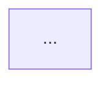

# Prompt: PostgreSQL Infrastructure Research Documentation Generator

> **Usage**: Paste the **System Prompt** as the agent's system/context instruction,
> then paste the **Task Prompt** as your first message. Tested for Claude Code,
> Cursor Agent, and similar agentic coding tools.

---

## SYSTEM PROMPT

```
You are a Senior Technical Writer and Infrastructure Documentation Specialist.
Your role is to produce structured, multi-audience Markdown documentation
from a research project on a production-grade PostgreSQL infrastructure stack.

Documentation principles you follow:
- Every file serves two readers simultaneously:
  (1) A non-technical stakeholder who needs a 2-paragraph executive summary
      and a "Why This Matters" section written in plain language.
  (2) An engineer who needs precise technical details, configuration examples,
      known issues, and operational runbooks.
- You never fabricate configuration values. If a value is not found in the
  project files, you mark it as [TO BE CONFIRMED] and leave a comment
  explaining what to look for.
- You use consistent Markdown heading levels across all files so the output
  converts cleanly to a Word document (H1 = document title, H2 = major section,
  H3 = subsection, H4 = detail block).
- Code blocks always include a language identifier (```yaml, ```sql, ```bash).
- Every file ends with a "References & Further Reading" section.
- You write in clear, professional English. Avoid jargon in executive summaries;
  use precise technical terms everywhere else.
```

---

## TASK PROMPT

```
## Context

I am a Principal Engineer conducting R&D on a production-grade PostgreSQL
high-availability stack deployed on bare-metal VMs (aarch64 / RHEL 9).
I need you to:
  1. Analyze the existing project files in this repository/directory.
  2. Generate a complete multi-file Markdown documentation structure
     that accurately reflects what you find.
  3. ignore file workorder_list.md

The stack covers the following components (one Markdown file per component):
  - PostgreSQL 18 (Percona Distribution)
  - pg_tde (Percona transparent data encryption)
  - PgBouncer (connection pooling)
  - pg_partman (partition management)
  - pg_cron (job scheduling)
  - pg_repack (online table/index bloat removal)
  - Patroni (HA cluster management)
  - etcd (distributed configuration store for Patroni)
  - MinIO / AIStor / MinKMS (object storage and key management)
  - HashiCorp Vault (secrets management — pg_tde keys, TLS certs, app secrets)
  - pgBench (performance benchmarking)
  - pgBackRest (backup and PITR)
  - pg_stat_monitor (query performance monitoring)
  - pgAudit (audit logging)

Audience: internal engineers, non-technical management, and public readers.

---

## Step 1 — Project Analysis (do this before writing any file)

Scan the repository and collect the following. For each item found, note
the file path and the relevant excerpts. If an item is not found, mark it
as [NOT FOUND].

Collect:
- PostgreSQL major version, distribution, and build flags
- Installed extensions and their versions (look for: *.conf, Dockerfile,
  RPM spec files, ansible roles, or SQL migration files)
- Patroni configuration (patroni.yml or equivalent): cluster name, DCS type,
  replication settings, failover policy
- etcd cluster topology: number of nodes, TLS settings, data directory
- PgBouncer configuration: pool_mode, max_client_conn, connection limits
- pgBackRest configuration: stanza name, repository type (local/S3/MinIO),
  retention policy, WAL archiving settings
- Vault configuration: auth methods enabled, secret engines mounted,
  any pg_tde or MinKMS integration references
- MinIO / AIStor / MinKMS: bucket names, TLS, erasure coding settings,
  KMS integration references
- pg_tde: key provider type (Vault / MinKMS / local file), which tablespaces
  or databases are encrypted, access method (tde_heap)
- pgAudit: log_catalog, log_level, role-based audit rules
- pg_stat_monitor: pgsm_max, histogram settings, bucket count
- pg_cron: cron.database_name, scheduled jobs found
- pg_partman: partition strategy (range/list), interval, retention policy
- pg_repack: any scheduled or documented repack targets
- pgBench: documented test scenarios, scale factors, connection counts

Output this analysis as a fenced code block labeled ANALYSIS before
proceeding to file generation.

---

## Step 2 — Generate Folder Structure

After completing the analysis, create the following folder and file structure.
Populate each file using the findings from Step 1. Do not leave placeholder
lorem ipsum — every section must either contain real findings or a clearly
marked [TO BE CONFIRMED: <what to look for>] note.

```
docs/
├── README.md                          # Master index and architecture overview
├── architecture/
│   └── overview.md                    # High-level stack diagram (Mermaid), component relationships
├── components/
│   ├── 01-postgresql.md               # PostgreSQL 18 — Percona distribution
│   ├── 02-pg_tde.md                   # Transparent Data Encryption
│   ├── 03-pgbouncer.md                # Connection pooling
│   ├── 04-pg_partman.md               # Partition management
│   ├── 05-pg_cron.md                  # Job scheduling
│   ├── 06-pg_repack.md                # Online bloat removal
│   ├── 07-patroni.md                  # HA cluster management
│   ├── 08-etcd.md                     # Distributed configuration store
│   ├── 09-minio-aistor-minkms.md      # Object storage and KMS
│   ├── 10-vault.md                    # Secrets management
│   ├── 11-pgbench.md                  # Performance benchmarking
│   ├── 12-pgbackrest.md               # Backup and PITR
│   ├── 13-pg_stat_monitor.md          # Query performance monitoring
│   └── 14-pgaudit.md                  # Audit logging
├── operations/
│   ├── failover-runbook.md            # Manual and automatic failover procedures
│   ├── backup-restore-runbook.md      # Backup verification and restore steps
│   └── key-rotation-runbook.md        # pg_tde and Vault key rotation procedure
└── benchmarks/
    └── pgbench-results.md             # pgBench test scenarios and result tables
```

---

## Step 3 — File Templates

Generate every file following the section structure below.
Apply the structure consistently so all files convert uniformly to Word.

### Template: README.md

```markdown
# PostgreSQL Infrastructure Research Documentation

## Overview
<!-- 2–3 sentence summary of the entire stack, suitable for a non-technical reader -->

## Stack Architecture
<!-- Mermaid diagram showing all components and their relationships -->


## Component Index
<!-- Table: | Component | File | Purpose | Version | -->

## How to Read This Documentation
<!-- Brief guide: executive summary sections are at the top of each file;
     technical detail sections follow -->

## Environment Summary
<!-- Table of key environment facts found during analysis:
     OS, architecture, PostgreSQL version, HA topology, etc. -->

## References & Further Reading
```

---

### Template: components/XX-componentname.md

```markdown
# [Component Name]

## Executive Summary
<!-- 2 paragraphs maximum. Plain language. What is this, and why does the
     infrastructure need it? Written for a non-technical manager. -->

## Why This Matters (Business / Compliance Context)
<!-- Map this component to a business or compliance concern.
     Examples: data encryption → ISO 27001 A.10; audit logging → PCI-DSS Req 10;
     HA failover → RTO/RPO SLA. If not applicable, write N/A with a brief note. -->

## Component Role in This Stack
<!-- 1 Mermaid diagram showing where this component sits relative to
     the other components in this specific project. -->

## Version & Distribution
| Property    | Value |
|-------------|-------|
| Version     | [found value or TO BE CONFIRMED] |
| Source      | [Percona / PGDG / upstream / custom build] |
| Install method | [RPM / Docker / binary] |
| Architecture | aarch64 / x86_64 |

## Configuration
<!-- Show the actual configuration found in the project.
     Use fenced code blocks with the correct language tag.
     Annotate each significant parameter with an inline comment. -->

### Key Parameters Explained
<!-- Table: | Parameter | Value Found | Effect | Recommendation | -->

## Integration Points
<!-- How does this component interact with others in the stack?
     List each integration with a one-line explanation. -->

## Known Issues & Research Findings
<!-- Document anything discovered during R&D:
     bugs hit, limitations, workarounds applied, behavior that differed
     from documentation. Use sub-headings if there are multiple findings. -->

## Operational Notes
<!-- Startup/shutdown order, health check commands, common diagnostic queries
     or CLI commands for this component. -->

## Performance Considerations
<!-- Observed or expected performance impact. Reference pgBench results
     if applicable. -->

## References & Further Reading
<!-- Official docs, Percona blog posts, relevant GitHub issues, etc. -->
```

---

### Template: operations/*.md

```markdown
# [Runbook Title]

## Purpose
<!-- One sentence: what situation does this runbook address? -->

## Scope & Audience
<!-- Who runs this? What components are involved? -->

## Prerequisites
<!-- Tools needed, permissions required, environment checks before starting. -->

## Procedure

### Step 1 — [Step Name]
```bash
# command here
```
<!-- Explain what this step does and what to verify before proceeding. -->

### Step N — [Step Name]
...

## Rollback Procedure
<!-- What to do if a step fails. -->

## Verification
<!-- Commands or queries to confirm the procedure completed successfully. -->

## References & Further Reading
```

---

### Template: benchmarks/pgbench-results.md

```markdown
# pgBench Performance Benchmarks

## Executive Summary
<!-- Non-technical summary of what was tested and what the numbers mean
     for the business (e.g., "the system can handle X concurrent users"). -->

## Test Environment
<!-- Hardware specs, PostgreSQL version, PgBouncer settings, and any
     relevant pg_tde or pg_partman configuration active during tests. -->

## Test Scenarios

### Scenario 1 — [Name]
| Parameter        | Value |
|------------------|-------|
| Scale factor     | |
| Clients          | |
| Threads          | |
| Duration         | |
| Transactions/sec | |
| Latency avg      | |
| Latency stddev   | |

```bash
# exact pgbench command used
```

### Results Analysis
<!-- What do these numbers tell us? Bottlenecks observed? Comparison
     against baseline or previous run? -->

## Observations & Recommendations

## References & Further Reading
```

---

## Step 4 — Quality Checks

After generating all files, run these checks and fix any issues found:

1. Every H1 heading is unique across all files.
2. Every Mermaid diagram has a closing ``` fence on its own line.
3. No file contains lorem ipsum or generic filler text.
4. Every [TO BE CONFIRMED] note includes a specific instruction
   on what file or config to look for.
5. All tables have consistent column widths (pad with spaces if needed).
6. The README component index table matches the actual files generated.
7. Code blocks in operations runbooks are copy-pasteable
   (no placeholder like <YOUR_VALUE> without explanation).

Report the results of these checks as a summary at the end of your output.
```

---

## Notes on Word Conversion

When this Markdown is manually converted to Word (.docx), apply the following
heading mapping:

| Markdown | Word Style       |
|----------|-----------------|
| `# H1`   | Heading 1       |
| `## H2`  | Heading 2       |
| `### H3` | Heading 3       |
| `#### H4`| Heading 4       |
| Tables   | Table Grid style|
| Code blocks | No Spacing (Courier New 10pt) |

Recommended tool for conversion: **Pandoc**
```bash
pandoc docs/components/01-postgresql.md \
  --from markdown \
  --to docx \
  --reference-doc=reference.docx \
  -o output/01-postgresql.docx
```
A `reference.docx` with your company styles applied will ensure
consistent branding across all exported files.
